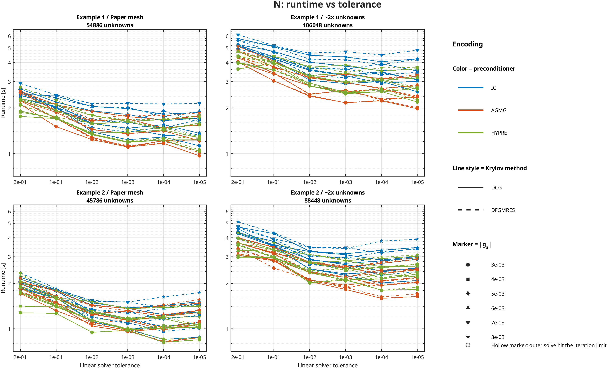
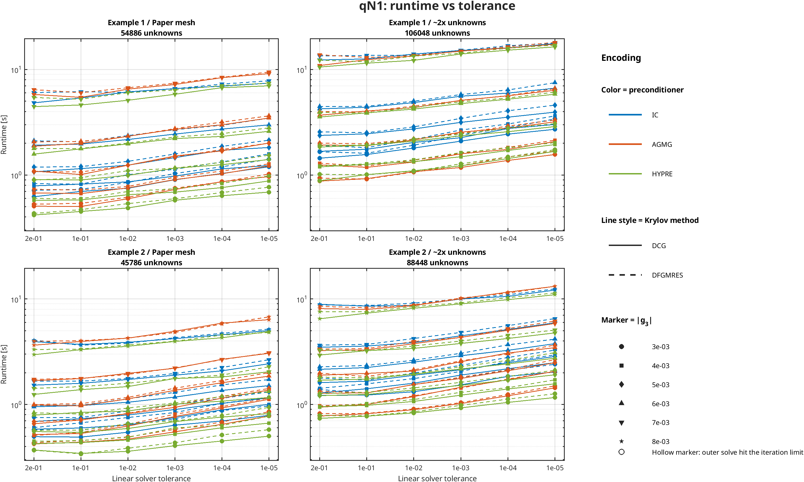
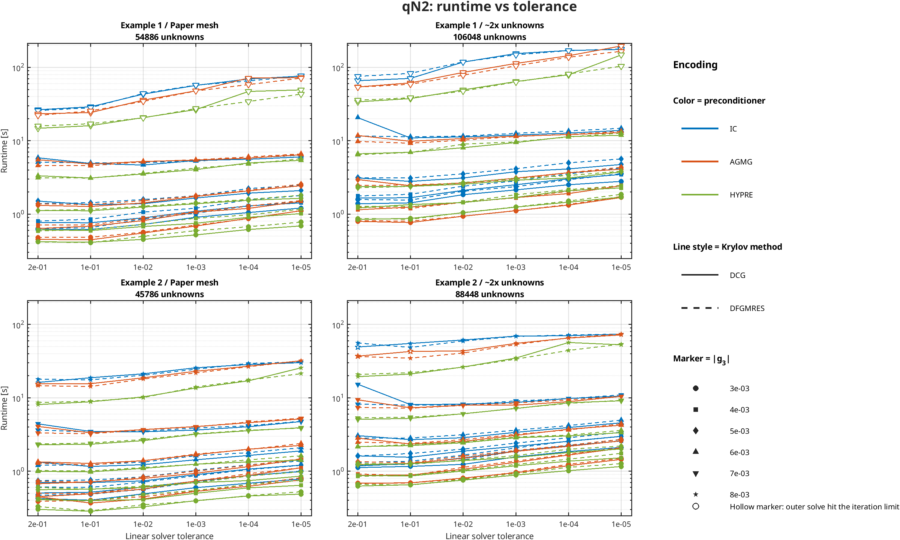

# Paper Tolerance Sweep for `nonlinear_Stokes_3D`

This report keeps the original paper results and appends a tolerance sweep run on this machine.

## Runtime Plots

The figures below show runtime versus linear solver tolerance with uniform spacing between tolerance labels and a log-scale runtime axis.
Each figure contains four data panels: Example 1/2 crossed with the paper mesh and the `~2x unknowns` mesh.

- color: preconditioner
- line style: Krylov method (`DCG` solid, `DFGMRES` dashed)
- marker: `|g_3|`
- hollow markers: the outer nonlinear method hit the iteration limit

### N

### qN1

### qN2

Generated from:
- [paper.tex](/home/beremi/repos/quasi-Newton/nonlinear_Stokes_3D/paper.tex)
- [PAPER_EXPERIMENTS.md](/home/beremi/repos/quasi-Newton/nonlinear_Stokes_3D/PAPER_EXPERIMENTS.md)
- [run_paper_tolerance_sweep.m](/home/beremi/repos/quasi-Newton/nonlinear_Stokes_3D/scripts/run_paper_tolerance_sweep.m)
- [run_paper_case.m](/home/beremi/repos/quasi-Newton/nonlinear_Stokes_3D/scripts/run_paper_case.m)
- [plot_paper_tolerance_sweep.m](/home/beremi/repos/quasi-Newton/nonlinear_Stokes_3D/scripts/plot_paper_tolerance_sweep.m)
- [paper_tolerance_sweep_results.mat](/home/beremi/repos/quasi-Newton/nonlinear_Stokes_3D/results/paper_tolerance_sweep_results.mat)

Sweep parameters:
- tolerances: `2e-01`, `1e-01`, `1e-02`, `1e-03`, `1e-04`, `1e-05`
- solver variants: `DCG + IC`, `DCG + AGMG`, `DCG + HYPRE`, `DFGMRES + IC`, `DFGMRES + AGMG`, `DFGMRES + HYPRE`
- mesh variants: `Paper-size mesh`, `~2x unknowns mesh`
- reported cell format in sweep tables: `outer iterations / cumulative linear iterations / runtime [s]`
- completed cases: `792 / 792`

## Fastest Tolerance Summary

Counts are taken over base experiment settings `example x mesh x solver variant x |g_3|` with a complete tolerance sweep and successful solves.
Cell format: `within-method wins (overall wins)` where `overall wins` means the same `method + tolerance` was the fastest across `N`, `qN1`, and `qN2` for that base experiment.

- complete base experiments included: `132`
- incomplete base experiments excluded from the count: `0`

| tol | N | qN1 | qN2 |
|---|---:|---:|---:|
| `2e-01` | `0 (0)` | `85 (21)` | `67 (28)` |
| `1e-01` | `0 (0)` | `47 (12)` | `63 (23)` |
| `1e-02` | `1 (1)` | `0 (0)` | `2 (0)` |
| `1e-03` | `51 (18)` | `0 (0)` | `0 (0)` |
| `1e-04` | `55 (29)` | `0 (0)` | `0 (0)` |
| `1e-05` | `25 (0)` | `0 (0)` | `0 (0)` |

## Original Paper Results

### Example 1: Paper Table

| `g_3` | `IC-N` | `IC-qN1` | `IC-qN2` | `AGMG-N` | `AGMG-qN1` | `AGMG-qN2` |
|---|---|---|---|---|---|---|
| `-3e-3` | `6/112/1.86` | `14/84/0.95` | `15/58/0.61` | `6/51/2.12` | `14/35/0.99` | `15/44/0.85` |
| `-4e-3` | `6/111/1.84` | `17/90/1.17` | `22/70/0.79` | `6/53/2.01` | `17/40/1.25` | `22/57/1.11` |
| `-5e-3` | `7/130/2.17` | `27/97/1.72` | `35/93/1.12` | `7/63/2.44` | `25/50/1.85` | `36/86/1.68` |
| `-6e-3` | `7/133/2.17` | `41/111/2.69` | `74/167/2.11` | `7/63/2.39` | `41/70/3.05` | `75/170/3.33` |
| `-7e-3` | `8/152/2.53` | `73/143/5.17` | `>200/-/5.53` | `8/76/2.84` | `72/108/5.63` | `>200/-/6.81` |

### Example 2: Paper Table

| `g_3` | `IC-N` | `IC-qN1` | `IC-qN2` | `AGMG-N` | `AGMG-qN1` | `AGMG-qN2` |
|---|---|---|---|---|---|---|
| `-3e-3` | `5/86/1.28` | `12/72/0.76` | `14/56/0.52` | `5/39/1.52` | `12/33/0.90` | `13/39/0.74` |
| `-4e-3` | `6/100/1.57` | `16/77/0.93` | `17/59/0.59` | `6/50/1.80` | `16/37/1.06` | `17/51/0.93` |
| `-5e-3` | `6/101/1.56` | `19/83/1.15` | `23/72/0.73` | `6/50/1.88` | `19/43/1.35` | `24/70/1.25` |
| `-6e-3` | `7/119/1.85` | `25/90/1.56` | `36/97/1.07` | `7/61/2.21` | `25/53/1.87` | `37/95/1.80` |
| `-7e-3` | `7/120/1.87` | `38/102/2.32` | `68/162/1.77` | `7/61/2.17` | `37/68/2.71` | `70/167/3.09` |
| `-8e-3` | `8/139/2.20` | `62/126/3.87` | `168/347/4.15` | `8/71/2.52` | `61/93/4.44` | `198/359/7.28` |

## Selected-Tolerance Replications

These tables use the current benchmark policy: `N` at `1e-4` and `qN1/qN2` at `1e-1`.
Cell format remains `outer nonlinear iterations / cumulative linear iterations / runtime [s]`.
- this section keeps only the `DCG + HYPRE` cut; legacy solver variants stay in the full sweep below
`<ins><strong>...</strong></ins>` marks the fastest converged runtime in the row within this `DCG + HYPRE` cut.
- `~~>300s~~` marks a nonlinear method stopped by the 300 s cap

### Example 1: Prismatic Bar

- boundary used in replication: `BC1`
- note: Matches the paper text and reproduces the reported unknown count 54,886.

#### Paper-size mesh

- density: `12`
- measured elements: `103680`
- measured unknowns: `54886`

##### DCG with HYPRE

| `g_3` | `HYPRE-N` | `HYPRE-qN1` | `HYPRE-qN2` |
|---|---|---|---|
| `-3e-03` | `6/33/1.23` | `14/28/0.45` | <ins><strong>15/28/0.41</strong></ins> |
| `-4e-03` | `6/34/1.23` | <ins><strong>17/30/0.58</strong></ins> | `23/32/0.60` |
| `-5e-03` | `7/38/1.43` | <ins><strong>25/37/0.90</strong></ins> | `36/43/1.11` |
| `-6e-03` | <ins><strong>7/39/1.44</strong></ins> | `41/57/1.77` | `74/69/3.10` |
| `-7e-03` | <ins><strong>8/45/1.68</strong></ins> | `73/119/4.61` | `>200/141/16.02` |

#### ~2x unknowns mesh

- density: `15`
- measured elements: `202500`
- measured unknowns: `106048`

##### DCG with HYPRE

| `g_3` | `HYPRE-N` | `HYPRE-qN1` | `HYPRE-qN2` |
|---|---|---|---|
| `-3e-03` | `6/34/2.58` | `14/30/1.01` | <ins><strong>15/31/0.87</strong></ins> |
| `-4e-03` | `6/34/2.56` | <ins><strong>17/31/1.26</strong></ins> | `23/33/1.35` |
| `-5e-03` | `7/41/3.06` | <ins><strong>25/39/1.91</strong></ins> | `37/44/2.38` |
| `-6e-03` | <ins><strong>7/40/3.06</strong></ins> | `41/60/3.88` | `75/72/6.95` |
| `-7e-03` | <ins><strong>8/46/3.51</strong></ins> | `73/123/11.48` | `>200/144/37.53` |

#### ~200k unknowns mesh

- density: `19`
- measured elements: `411540`
- measured unknowns: `213520`

##### DCG with HYPRE

| `g_3` | `HYPRE-N` | `HYPRE-qN1` | `HYPRE-qN2` |
|---|---|---|---|
| `-3e-03` | `6/37/5.62` | `14/32/2.34` | <ins><strong>15/36/2.06</strong></ins> |
| `-4e-03` | `6/37/5.60` | `17/37/3.07` | <ins><strong>22/42/2.96</strong></ins> |
| `-5e-03` | `7/44/6.62` | <ins><strong>25/44/4.58</strong></ins> | `37/48/5.74` |
| `-6e-03` | <ins><strong>7/45/6.84</strong></ins> | `41/66/9.15` | `76/77/18.63` |
| `-7e-03` | <ins><strong>8/51/7.86</strong></ins> | `73/130/28.82` | `>200/148/95.83` |

### Example 2: Tapered Prismatic Bar

- boundary used in replication: `BC1`
- note: paper.tex states u_3 = 0 on the shell, but that is inconsistent with a constant inlet profile. A calibration run showed BC1 (u·n = 0 on the shell) is much closer to the paper table than BC3.

#### Paper-size mesh

- density: `12`
- measured elements: `86400`
- measured unknowns: `45786`

##### DCG with HYPRE

| `g_3` | `HYPRE-N` | `HYPRE-qN1` | `HYPRE-qN2` |
|---|---|---|---|
| `-3e-03` | `5/26/0.82` | `11/22/0.34` | <ins><strong>12/25/0.28</strong></ins> |
| `-4e-03` | `6/31/1.02` | `16/25/0.44` | <ins><strong>18/25/0.40</strong></ins> |
| `-5e-03` | `6/31/1.01` | <ins><strong>19/28/0.54</strong></ins> | `24/31/0.57` |
| `-6e-03` | `7/36/1.17` | <ins><strong>25/35/0.84</strong></ins> | `37/41/0.98` |
| `-7e-03` | <ins><strong>7/37/1.19</strong></ins> | `38/50/1.38` | `67/61/2.33` |
| `-8e-03` | <ins><strong>8/43/1.38</strong></ins> | `62/93/3.31` | `161/123/8.83` |

#### ~2x unknowns mesh

- density: `15`
- measured elements: `168750`
- measured unknowns: `88448`

##### DCG with HYPRE

| `g_3` | `HYPRE-N` | `HYPRE-qN1` | `HYPRE-qN2` |
|---|---|---|---|
| `-3e-03` | `5/27/1.80` | `11/24/0.77` | <ins><strong>12/26/0.65</strong></ins> |
| `-4e-03` | `6/33/2.14` | `16/28/0.98` | <ins><strong>17/31/0.86</strong></ins> |
| `-5e-03` | `6/32/2.31` | <ins><strong>19/31/1.24</strong></ins> | `25/33/1.26` |
| `-6e-03` | `7/38/2.55` | <ins><strong>25/38/1.74</strong></ins> | `37/42/2.23` |
| `-7e-03` | <ins><strong>7/40/2.58</strong></ins> | `38/57/3.24` | `68/64/5.24` |
| `-8e-03` | <ins><strong>8/45/2.92</strong></ins> | `62/98/7.34` | `163/126/21.10` |

#### ~200k unknowns mesh

- density: `19`
- measured elements: `342228`
- measured unknowns: `177680`

##### DCG with HYPRE

| `g_3` | `HYPRE-N` | `HYPRE-qN1` | `HYPRE-qN2` |
|---|---|---|---|
| `-3e-03` | `5/29/3.95` | `11/25/1.84` | <ins><strong>13/29/1.70</strong></ins> |
| `-4e-03` | `6/36/4.83` | `16/32/2.43` | <ins><strong>17/34/2.09</strong></ins> |
| `-5e-03` | `6/35/4.67` | `19/34/3.09` | <ins><strong>25/35/2.85</strong></ins> |
| `-6e-03` | `7/41/5.47` | <ins><strong>25/42/4.16</strong></ins> | `38/45/5.45` |
| `-7e-03` | <ins><strong>7/40/5.38</strong></ins> | `38/61/7.34` | `69/67/13.28` |
| `-8e-03` | <ins><strong>8/48/6.36</strong></ins> | `62/97/16.79` | `166/132/52.34` |

## Sweep Results on This Machine

Notes:
- Example 1 uses `BC1`, which reproduces the paper unknown count exactly.
- Example 2 is ambiguous in the paper text. The sweep uses `BC1` because it is materially closer to the reported table than the literal `u_3 = 0` shell variant.
- The `~2x unknowns mesh` corresponds to density `15`, which yields approximately double the unknown count compared with the paper-size density `12` mesh.

### Example 1: Prismatic Bar

- boundary used in sweep: `BC1`
- note: Matches the paper text and reproduces the reported unknown count 54,886.
- paper reported mesh: `103680` elements, `54886` unknowns

#### Paper-size mesh

- density: `12`
- measured elements: `103680`
- measured unknowns: `54886`

##### DCG + IC

| tol | g3 | unknowns | N | qN1 | qN2 | status |
|---|---|---|---|---|---|---|
| `2e-01` | `-3e-03` | `54886` | `13/99/2.32` | `14/105/0.62` | `17/109/0.61` | ok |
| `2e-01` | `-4e-03` | `54886` | `14/105/2.43` | `17/109/0.79` | `23/116/0.76` | ok |
| `2e-01` | `-5e-03` | `54886` | `15/109/2.58` | `27/125/1.07` | `43/120/1.50` | ok |
| `2e-01` | `-6e-03` | `54886` | `15/115/2.68` | `41/155/1.91` | `107/172/5.85` | ok |
| `2e-01` | `-7e-03` | `54886` | `14/124/2.48` | `76/223/4.83` | `>200/217/26.43` | ok |
| `1e-01` | `-3e-03` | `54886` | `11/109/2.05` | `14/121/0.70` | `15/121/0.62` | ok |
| `1e-01` | `-4e-03` | `54886` | `11/109/2.12` | `17/132/0.82` | `22/122/0.76` | ok |
| `1e-01` | `-5e-03` | `54886` | `11/115/1.99` | `27/141/1.15` | `36/133/1.34` | ok |
| `1e-01` | `-6e-03` | `54886` | `12/123/2.19` | `41/165/1.96` | `76/164/4.90` | ok |
| `1e-01` | `-7e-03` | `54886` | `13/133/2.41` | `73/244/5.37` | `>200/238/28.97` | ok |
| `1e-02` | `-3e-03` | `54886` | `7/121/1.39` | `14/151/0.75` | `15/165/0.72` | ok |
| `1e-02` | `-4e-03` | `54886` | `8/135/1.59` | `17/152/0.86` | `22/167/0.89` | ok |
| `1e-02` | `-5e-03` | `54886` | `8/137/1.58` | `27/180/1.24` | `35/173/1.38` | ok |
| `1e-02` | `-6e-03` | `54886` | `9/150/1.92` | `41/221/2.17` | `73/226/4.66` | ok |
| `1e-02` | `-7e-03` | `54886` | `10/159/2.05` | `72/326/6.13` | `>200/351/43.18` | ok |
| `1e-03` | `-3e-03` | `54886` | `6/127/1.24` | `14/196/0.90` | `15/215/0.90` | ok |
| `1e-03` | `-4e-03` | `54886` | `7/144/1.47` | `17/187/0.98` | `22/221/1.09` | ok |
| `1e-03` | `-5e-03` | `54886` | `7/145/1.47` | `27/238/1.46` | `35/243/1.65` | ok |
| `1e-03` | `-6e-03` | `54886` | `8/162/1.82` | `41/292/2.44` | `73/318/5.37` | ok |
| `1e-03` | `-7e-03` | `54886` | `9/185/1.99` | `72/465/6.59` | `>200/500/56.75` | ok |
| `1e-04` | `-3e-03` | `54886` | `6/143/1.29` | `14/233/1.03` | `15/259/1.05` | ok |
| `1e-04` | `-4e-03` | `54886` | `6/142/1.32` | `17/239/1.14` | `22/282/1.29` | ok |
| `1e-04` | `-5e-03` | `54886` | `7/167/1.56` | `27/285/1.72` | `35/308/1.93` | ok |
| `1e-04` | `-6e-03` | `54886` | `7/168/1.65` | `41/374/2.72` | `73/413/5.58` | ok |
| `1e-04` | `-7e-03` | `54886` | `8/192/1.82` | `72/563/6.95` | `>200/670/69.44` | ok |
| `1e-05` | `-3e-03` | `54886` | `5/133/1.13` | `14/271/1.20` | `15/297/1.21` | ok |
| `1e-05` | `-4e-03` | `54886` | `6/158/1.33` | `17/276/1.23` | `22/337/1.42` | ok |
| `1e-05` | `-5e-03` | `54886` | `6/161/1.36` | `27/355/1.82` | `35/378/2.09` | ok |
| `1e-05` | `-6e-03` | `54886` | `7/187/1.72` | `41/457/2.98` | `73/520/6.00` | ok |
| `1e-05` | `-7e-03` | `54886` | `8/217/1.87` | `72/703/7.43` | `>200/846/75.95` | ok |

##### DCG + AGMG

| tol | g3 | unknowns | N | qN1 | qN2 | status |
|---|---|---|---|---|---|---|
| `2e-01` | `-3e-03` | `54886` | `12/32/2.13` | `14/33/0.51` | `16/36/0.45` | ok |
| `2e-01` | `-4e-03` | `54886` | `13/34/2.24` | `18/40/0.68` | `22/39/0.63` | ok |
| `2e-01` | `-5e-03` | `54886` | `13/37/2.25` | `27/56/1.09` | `38/56/1.31` | ok |
| `2e-01` | `-6e-03` | `54886` | `14/40/2.55` | `41/79/1.87` | `98/102/5.50` | ok |
| `2e-01` | `-7e-03` | `54886` | `15/42/2.59` | `74/162/5.80` | `>200/159/23.27` | ok |
| `1e-01` | `-3e-03` | `54886` | `9/31/1.51` | `14/39/0.50` | `15/38/0.45` | ok |
| `1e-01` | `-4e-03` | `54886` | `10/33/1.71` | `17/44/0.67` | `22/50/0.68` | ok |
| `1e-01` | `-5e-03` | `54886` | `11/36/1.87` | `25/56/1.01` | `36/64/1.27` | ok |
| `1e-01` | `-6e-03` | `54886` | `11/38/1.91` | `41/93/1.99` | `77/99/4.81` | ok |
| `1e-01` | `-7e-03` | `54886` | `12/43/2.10` | `73/177/5.44` | `>200/166/24.18` | ok |
| `1e-02` | `-3e-03` | `54886` | `7/37/1.24` | `14/53/0.59` | `15/57/0.55` | ok |
| `1e-02` | `-4e-03` | `54886` | `7/36/1.28` | `17/61/0.75` | `22/72/0.81` | ok |
| `1e-02` | `-5e-03` | `54886` | `8/41/1.44` | `27/90/1.24` | `35/88/1.42` | ok |
| `1e-02` | `-6e-03` | `54886` | `9/48/1.64` | `41/146/2.33` | `73/133/5.21` | ok |
| `1e-02` | `-7e-03` | `54886` | `10/55/1.91` | `72/249/6.52` | `>200/271/35.71` | ok |
| `1e-03` | `-3e-03` | `54886` | `6/42/1.11` | `14/72/0.73` | `15/78/0.69` | ok |
| `1e-03` | `-4e-03` | `54886` | `6/43/1.11` | `17/83/0.90` | `22/99/1.06` | ok |
| `1e-03` | `-5e-03` | `54886` | `7/50/1.36` | `27/132/1.51` | `35/132/1.74` | ok |
| `1e-03` | `-6e-03` | `54886` | `8/60/1.70` | `41/203/2.71` | `73/200/5.43` | ok |
| `1e-03` | `-7e-03` | `54886` | `9/67/1.76` | `72/359/7.21` | `>200/375/47.86` | ok |
| `1e-04` | `-3e-03` | `54886` | `6/51/1.17` | `14/96/0.86` | `15/108/0.87` | ok |
| `1e-04` | `-4e-03` | `54886` | `6/53/1.22` | `17/112/1.03` | `22/135/1.19` | ok |
| `1e-04` | `-5e-03` | `54886` | `7/63/1.42` | `27/170/1.69` | `35/195/2.07` | ok |
| `1e-04` | `-6e-03` | `54886` | `7/63/1.47` | `41/266/2.99` | `73/269/5.79` | ok |
| `1e-04` | `-7e-03` | `54886` | `8/76/1.68` | `72/497/8.37` | `>200/1504/71.53` | ok |
| `1e-05` | `-3e-03` | `54886` | `5/49/0.97` | `14/116/0.97` | `15/144/1.11` | ok |
| `1e-05` | `-4e-03` | `54886` | `6/65/1.21` | `17/136/1.22` | `22/184/1.49` | ok |
| `1e-05` | `-5e-03` | `54886` | `6/64/1.22` | `27/217/2.01` | `35/242/2.44` | ok |
| `1e-05` | `-6e-03` | `54886` | `7/78/1.56` | `41/329/3.47` | `73/365/6.42` | ok |
| `1e-05` | `-7e-03` | `54886` | `8/94/1.77` | `72/632/9.14` | `>200/646/72.38` | ok |

##### DCG + HYPRE

| tol | g3 | unknowns | N | qN1 | qN2 | status |
|---|---|---|---|---|---|---|
| `2e-01` | `-3e-03` | `54886` | `9/19/1.76` | `13/23/0.42` | `17/25/0.42` | ok |
| `2e-01` | `-4e-03` | `54886` | `10/21/1.88` | `18/28/0.57` | `23/31/0.61` | ok |
| `2e-01` | `-5e-03` | `54886` | `10/22/1.91` | `25/35/0.91` | `37/42/1.12` | ok |
| `2e-01` | `-6e-03` | `54886` | `12/22/2.30` | `41/55/1.58` | `75/67/3.33` | ok |
| `2e-01` | `-7e-03` | `54886` | `12/25/2.30` | `74/111/4.45` | `>200/140/14.76` | ok |
| `1e-01` | `-3e-03` | `54886` | `9/20/1.70` | `14/28/0.45` | `15/28/0.41` | ok |
| `1e-01` | `-4e-03` | `54886` | `9/21/1.72` | `17/30/0.58` | `23/32/0.60` | ok |
| `1e-01` | `-5e-03` | `54886` | `9/22/1.71` | `25/37/0.90` | `36/43/1.11` | ok |
| `1e-01` | `-6e-03` | `54886` | `10/24/1.93` | `41/57/1.77` | `74/69/3.10` | ok |
| `1e-01` | `-7e-03` | `54886` | `11/26/2.12` | `73/119/4.61` | `>200/141/16.02` | ok |
| `1e-02` | `-3e-03` | `54886` | `7/24/1.35` | `14/35/0.49` | `15/39/0.45` | ok |
| `1e-02` | `-4e-03` | `54886` | `7/24/1.33` | `17/38/0.65` | `22/50/0.68` | ok |
| `1e-02` | `-5e-03` | `54886` | `7/24/1.37` | `27/54/0.99` | `35/63/1.24` | ok |
| `1e-02` | `-6e-03` | `54886` | `8/28/1.57` | `41/85/1.97` | `73/80/3.52` | ok |
| `1e-02` | `-7e-03` | `54886` | `9/32/1.79` | `72/158/5.11` | `>200/158/20.66` | ok |
| `1e-03` | `-3e-03` | `54886` | `6/27/1.20` | `14/46/0.58` | `15/55/0.52` | ok |
| `1e-03` | `-4e-03` | `54886` | `6/28/1.19` | `17/52/0.69` | `22/70/0.75` | ok |
| `1e-03` | `-5e-03` | `54886` | `7/32/1.38` | `27/76/1.16` | `35/80/1.38` | ok |
| `1e-03` | `-6e-03` | `54886` | `8/36/1.63` | `41/119/2.21` | `73/121/4.04` | ok |
| `1e-03` | `-7e-03` | `54886` | `8/37/1.64` | `72/227/5.82` | `>200/222/26.55` | ok |
| `1e-04` | `-3e-03` | `54886` | `6/33/1.23` | `14/60/0.64` | `15/68/0.62` | ok |
| `1e-04` | `-4e-03` | `54886` | `6/34/1.23` | `17/66/0.76` | `22/89/0.90` | ok |
| `1e-04` | `-5e-03` | `54886` | `7/38/1.43` | `27/101/1.25` | `35/107/1.54` | ok |
| `1e-04` | `-6e-03` | `54886` | `7/39/1.44` | `41/157/2.32` | `73/157/4.97` | ok |
| `1e-04` | `-7e-03` | `54886` | `8/45/1.68` | `72/289/6.73` | `>200/2283/46.94` | ok |
| `1e-05` | `-3e-03` | `54886` | `5/32/1.04` | `14/74/0.69` | `15/83/0.69` | ok |
| `1e-05` | `-4e-03` | `54886` | `6/39/1.24` | `17/83/0.88` | `22/111/1.01` | ok |
| `1e-05` | `-5e-03` | `54886` | `6/40/1.28` | `27/123/1.40` | `35/133/1.64` | ok |
| `1e-05` | `-6e-03` | `54886` | `7/45/1.60` | `41/197/2.59` | `73/209/5.40` | ok |
| `1e-05` | `-7e-03` | `54886` | `8/53/1.73` | `72/386/7.00` | `>200/1354/49.26` | ok |

##### DFGMRES + IC

| tol | g3 | unknowns | N | qN1 | qN2 | status |
|---|---|---|---|---|---|---|
| `2e-01` | `-3e-03` | `54886` | `13/86/2.32` | `15/95/0.72` | `16/93/0.63` | ok |
| `2e-01` | `-4e-03` | `54886` | `14/92/2.50` | `19/104/0.83` | `22/101/0.80` | ok |
| `2e-01` | `-5e-03` | `54886` | `14/96/2.61` | `26/118/1.19` | `37/109/1.39` | ok |
| `2e-01` | `-6e-03` | `54886` | `15/101/2.70` | `43/140/2.11` | `81/145/5.08` | ok |
| `2e-01` | `-7e-03` | `54886` | `16/115/2.92` | `77/219/6.04` | `>200/213/25.74` | ok |
| `1e-01` | `-3e-03` | `54886` | `11/100/2.02` | `14/108/0.73` | `15/106/0.65` | ok |
| `1e-01` | `-4e-03` | `54886` | `11/100/2.02` | `17/106/0.82` | `22/115/0.85` | ok |
| `1e-01` | `-5e-03` | `54886` | `11/99/2.03` | `25/127/1.20` | `36/129/1.43` | ok |
| `1e-01` | `-6e-03` | `54886` | `12/105/2.33` | `41/149/2.06` | `75/169/4.98` | ok |
| `1e-01` | `-7e-03` | `54886` | `13/118/2.45` | `74/226/6.16` | `>200/234/28.15` | ok |
| `1e-02` | `-3e-03` | `54886` | `7/115/1.49` | `14/139/0.85` | `15/146/0.86` | ok |
| `1e-02` | `-4e-03` | `54886` | `8/127/1.70` | `17/138/1.01` | `22/152/1.06` | ok |
| `1e-02` | `-5e-03` | `54886` | `8/121/1.65` | `27/160/1.35` | `35/171/1.58` | ok |
| `1e-02` | `-6e-03` | `54886` | `9/140/2.05` | `41/207/2.36` | `73/207/5.05` | ok |
| `1e-02` | `-7e-03` | `54886` | `10/151/2.14` | `72/299/6.07` | `>200/348/44.13` | ok |
| `1e-03` | `-3e-03` | `54886` | `6/122/1.39` | `14/177/1.03` | `15/187/1.03` | ok |
| `1e-03` | `-4e-03` | `54886` | `7/141/1.61` | `17/175/1.13` | `22/200/1.20` | ok |
| `1e-03` | `-5e-03` | `54886` | `7/141/1.61` | `27/218/1.58` | `35/223/1.78` | ok |
| `1e-03` | `-6e-03` | `54886` | `8/160/2.02` | `41/277/2.69` | `73/284/5.26` | ok |
| `1e-03` | `-7e-03` | `54886` | `9/180/2.15` | `72/405/6.57` | `>200/439/57.28` | ok |
| `1e-04` | `-3e-03` | `54886` | `6/141/1.51` | `14/214/1.20` | `15/243/1.29` | ok |
| `1e-04` | `-4e-03` | `54886` | `6/140/1.48` | `17/215/1.33` | `22/266/1.56` | ok |
| `1e-04` | `-5e-03` | `54886` | `7/163/1.92` | `27/269/1.87` | `35/310/2.22` | ok |
| `1e-04` | `-6e-03` | `54886` | `7/161/1.76` | `41/343/2.96` | `73/386/5.81` | ok |
| `1e-04` | `-7e-03` | `54886` | `8/188/2.13` | `72/542/7.27` | `>200/603/65.20` | ok |
| `1e-05` | `-3e-03` | `54886` | `5/131/1.32` | `14/258/1.41` | `15/288/1.47` | ok |
| `1e-05` | `-4e-03` | `54886` | `6/153/1.69` | `17/268/1.58` | `22/323/1.79` | ok |
| `1e-05` | `-5e-03` | `54886` | `6/157/1.61` | `27/333/2.14` | `35/372/2.48` | ok |
| `1e-05` | `-6e-03` | `54886` | `7/183/1.90` | `41/429/3.46` | `73/508/6.34` | ok |
| `1e-05` | `-7e-03` | `54886` | `8/211/2.15` | `72/679/7.81` | `>200/786/76.96` | ok |

##### DFGMRES + AGMG

| tol | g3 | unknowns | N | qN1 | qN2 | status |
|---|---|---|---|---|---|---|
| `2e-01` | `-3e-03` | `54886` | `13/30/2.24` | `15/31/0.53` | `16/32/0.48` | ok |
| `2e-01` | `-4e-03` | `54886` | `13/34/2.23` | `19/40/0.73` | `23/39/0.71` | ok |
| `2e-01` | `-5e-03` | `54886` | `13/35/2.25` | `26/51/1.08` | `37/56/1.38` | ok |
| `2e-01` | `-6e-03` | `54886` | `14/38/2.56` | `42/79/2.06` | `83/90/4.60` | ok |
| `2e-01` | `-7e-03` | `54886` | `14/40/2.50` | `75/161/6.44` | `>200/157/22.12` | ok |
| `1e-01` | `-3e-03` | `54886` | `10/32/1.72` | `14/34/0.54` | `15/35/0.48` | ok |
| `1e-01` | `-4e-03` | `54886` | `10/30/1.71` | `18/43/0.72` | `22/44/0.71` | ok |
| `1e-01` | `-5e-03` | `54886` | `11/36/1.92` | `25/56/1.07` | `36/62/1.34` | ok |
| `1e-01` | `-6e-03` | `54886` | `11/37/1.94` | `41/83/2.08` | `74/102/4.56` | ok |
| `1e-01` | `-7e-03` | `54886` | `12/41/2.13` | `73/167/6.03` | `>200/175/25.51` | ok |
| `1e-02` | `-3e-03` | `54886` | `7/35/1.27` | `14/49/0.61` | `15/49/0.57` | ok |
| `1e-02` | `-4e-03` | `54886` | `7/33/1.26` | `17/56/0.78` | `22/68/0.88` | ok |
| `1e-02` | `-5e-03` | `54886` | `8/40/1.45` | `27/82/1.24` | `35/87/1.52` | ok |
| `1e-02` | `-6e-03` | `54886` | `9/45/1.66` | `41/123/2.32` | `73/128/5.15` | ok |
| `1e-02` | `-7e-03` | `54886` | `9/45/1.68` | `72/244/6.71` | `>200/260/34.31` | ok |
| `1e-03` | `-3e-03` | `54886` | `6/37/1.10` | `14/65/0.75` | `15/70/0.71` | ok |
| `1e-03` | `-4e-03` | `54886` | `6/38/1.13` | `17/79/0.95` | `22/98/1.08` | ok |
| `1e-03` | `-5e-03` | `54886` | `7/46/1.34` | `27/114/1.48` | `35/125/1.77` | ok |
| `1e-03` | `-6e-03` | `54886` | `8/55/1.68` | `41/178/2.75` | `73/181/5.50` | ok |
| `1e-03` | `-7e-03` | `54886` | `9/63/1.81` | `72/340/7.41` | `>200/356/47.72` | ok |
| `1e-04` | `-3e-03` | `54886` | `6/49/1.23` | `14/85/0.86` | `15/100/0.86` | ok |
| `1e-04` | `-4e-03` | `54886` | `6/50/1.17` | `17/106/1.09` | `22/129/1.29` | ok |
| `1e-04` | `-5e-03` | `54886` | `7/61/1.43` | `27/157/1.74` | `35/176/2.11` | ok |
| `1e-04` | `-6e-03` | `54886` | `7/60/1.49` | `41/243/3.17` | `73/261/6.00` | ok |
| `1e-04` | `-7e-03` | `54886` | `8/70/1.78` | `72/463/8.43` | `>200/470/58.26` | ok |
| `1e-05` | `-3e-03` | `54886` | `5/46/1.01` | `14/111/1.02` | `15/133/1.12` | ok |
| `1e-05` | `-4e-03` | `54886` | `6/60/1.26` | `17/128/1.28` | `22/169/1.53` | ok |
| `1e-05` | `-5e-03` | `54886` | `6/60/1.27` | `27/196/2.00` | `35/236/2.56` | ok |
| `1e-05` | `-6e-03` | `54886` | `7/73/1.54` | `41/311/3.63` | `73/344/6.60` | ok |
| `1e-05` | `-7e-03` | `54886` | `8/88/1.86` | `72/606/9.46` | `>200/612/71.38` | ok |

##### DFGMRES + HYPRE

| tol | g3 | unknowns | N | qN1 | qN2 | status |
|---|---|---|---|---|---|---|
| `2e-01` | `-3e-03` | `54886` | `11/18/2.11` | `14/19/0.43` | `17/21/0.42` | ok |
| `2e-01` | `-4e-03` | `54886` | `12/19/2.29` | `18/25/0.60` | `22/26/0.59` | ok |
| `2e-01` | `-5e-03` | `54886` | `11/19/2.09` | `25/32/0.89` | `36/36/1.12` | ok |
| `2e-01` | `-6e-03` | `54886` | `11/20/2.23` | `42/51/1.78` | `74/64/3.13` | ok |
| `2e-01` | `-7e-03` | `54886` | `14/22/2.75` | `78/111/5.43` | `>200/137/15.85` | ok |
| `1e-01` | `-3e-03` | `54886` | `9/18/1.74` | `14/24/0.47` | `15/24/0.41` | ok |
| `1e-01` | `-4e-03` | `54886` | `9/19/1.72` | `17/27/0.60` | `22/29/0.61` | ok |
| `1e-01` | `-5e-03` | `54886` | `9/19/1.74` | `25/35/0.94` | `36/40/1.15` | ok |
| `1e-01` | `-6e-03` | `54886` | `10/20/1.94` | `41/55/1.78` | `74/67/3.10` | ok |
| `1e-01` | `-7e-03` | `54886` | `11/23/2.27` | `73/111/5.23` | `>200/140/17.07` | ok |
| `1e-02` | `-3e-03` | `54886` | `7/22/1.36` | `14/32/0.54` | `15/37/0.50` | ok |
| `1e-02` | `-4e-03` | `54886` | `7/22/1.35` | `17/39/0.70` | `22/47/0.73` | ok |
| `1e-02` | `-5e-03` | `54886` | `8/26/1.60` | `27/52/1.10` | `35/58/1.28` | ok |
| `1e-02` | `-6e-03` | `54886` | `8/26/1.58` | `41/76/2.01` | `73/78/3.59` | ok |
| `1e-02` | `-7e-03` | `54886` | `9/29/1.79` | `72/146/6.03` | `>200/155/20.48` | ok |
| `1e-03` | `-3e-03` | `54886` | `6/26/1.21` | `14/44/0.60` | `15/52/0.59` | ok |
| `1e-03` | `-4e-03` | `54886` | `6/25/1.20` | `17/51/0.74` | `22/66/0.88` | ok |
| `1e-03` | `-5e-03` | `54886` | `7/30/1.43` | `27/71/1.16` | `35/76/1.42` | ok |
| `1e-03` | `-6e-03` | `54886` | `8/33/1.63` | `41/117/2.29` | `73/118/4.23` | ok |
| `1e-03` | `-7e-03` | `54886` | `8/36/1.67` | `72/215/6.39` | `>200/217/27.44` | ok |
| `1e-04` | `-3e-03` | `54886` | `6/31/1.27` | `14/57/0.68` | `15/67/0.67` | ok |
| `1e-04` | `-4e-03` | `54886` | `6/31/1.25` | `17/65/0.83` | `22/86/0.97` | ok |
| `1e-04` | `-5e-03` | `54886` | `7/37/1.48` | `27/98/1.32` | `35/104/1.58` | ok |
| `1e-04` | `-6e-03` | `54886` | `7/37/1.48` | `41/152/2.47` | `73/159/4.83` | ok |
| `1e-04` | `-7e-03` | `54886` | `8/41/1.70` | `72/291/7.03` | `>200/276/34.23` | ok |
| `1e-05` | `-3e-03` | `54886` | `5/31/1.06` | `14/72/0.77` | `15/82/0.78` | ok |
| `1e-05` | `-4e-03` | `54886` | `6/38/1.30` | `17/81/0.98` | `22/109/1.17` | ok |
| `1e-05` | `-5e-03` | `54886` | `6/38/1.30` | `27/121/1.54` | `35/132/1.80` | ok |
| `1e-05` | `-6e-03` | `54886` | `7/45/1.55` | `41/190/2.79` | `73/189/5.68` | ok |
| `1e-05` | `-7e-03` | `54886` | `8/52/1.79` | `72/370/7.43` | `>200/341/43.20` | ok |

#### ~2x unknowns mesh

- density: `15`
- measured elements: `202500`
- measured unknowns: `106048`

##### DCG + IC

| tol | g3 | unknowns | N | qN1 | qN2 | status |
|---|---|---|---|---|---|---|
| `2e-01` | `-3e-03` | `106048` | `14/130/5.17` | `15/135/1.44` | `17/132/1.38` | ok |
| `2e-01` | `-4e-03` | `106048` | `14/128/5.14` | `17/141/1.68` | `23/140/1.65` | ok |
| `2e-01` | `-5e-03` | `106048` | `14/135/5.24` | `26/156/2.37` | `42/151/3.11` | ok |
| `2e-01` | `-6e-03` | `106048` | `14/138/5.28` | `41/187/4.23` | `137/225/20.63` | ok |
| `2e-01` | `-7e-03` | `106048` | `15/157/5.76` | `74/266/12.32` | `>200/246/65.81` | ok |
| `1e-01` | `-3e-03` | `106048` | `11/133/4.19` | `14/158/1.56` | `15/149/1.42` | ok |
| `1e-01` | `-4e-03` | `106048` | `11/138/4.22` | `17/152/1.75` | `22/152/1.67` | ok |
| `1e-01` | `-5e-03` | `106048` | `11/152/4.37` | `25/176/2.45` | `36/161/2.79` | ok |
| `1e-01` | `-6e-03` | `106048` | `12/154/4.75` | `41/207/4.39` | `76/199/10.91` | ok |
| `1e-01` | `-7e-03` | `106048` | `13/165/5.14` | `73/301/12.59` | `>200/266/70.74` | ok |
| `1e-02` | `-3e-03` | `106048` | `7/150/3.06` | `14/189/1.80` | `15/207/1.84` | ok |
| `1e-02` | `-4e-03` | `106048` | `8/168/3.56` | `17/192/2.03` | `22/209/2.10` | ok |
| `1e-02` | `-5e-03` | `106048` | `8/171/3.60` | `25/214/2.73` | `35/213/3.10` | ok |
| `1e-02` | `-6e-03` | `106048` | `9/189/4.03` | `41/288/4.85` | `74/293/11.26` | ok |
| `1e-02` | `-7e-03` | `106048` | `10/201/4.48` | `72/417/14.00` | `>200/421/118.03` | ok |
| `1e-03` | `-3e-03` | `106048` | `6/158/2.91` | `14/245/2.09` | `15/269/2.14` | ok |
| `1e-03` | `-4e-03` | `106048` | `7/181/3.28` | `17/234/2.26` | `22/277/2.51` | ok |
| `1e-03` | `-5e-03` | `106048` | `7/184/3.31` | `25/271/3.15` | `35/313/3.77` | ok |
| `1e-03` | `-6e-03` | `106048` | `8/203/3.80` | `41/366/5.58` | `74/388/11.96` | ok |
| `1e-03` | `-7e-03` | `106048` | `9/233/4.36` | `72/547/15.16` | `>200/571/154.25` | ok |
| `1e-04` | `-3e-03` | `106048` | `6/177/3.01` | `14/292/2.44` | `15/322/2.51` | ok |
| `1e-04` | `-4e-03` | `106048` | `6/178/2.92` | `17/302/2.75` | `22/354/3.02` | ok |
| `1e-04` | `-5e-03` | `106048` | `7/209/3.48` | `25/333/3.53` | `35/369/4.13` | ok |
| `1e-04` | `-6e-03` | `106048` | `7/210/3.53` | `41/438/5.97` | `74/487/12.71` | ok |
| `1e-04` | `-7e-03` | `106048` | `8/242/4.06` | `72/684/16.02` | `>200/827/169.91` | ok |
| `1e-05` | `-3e-03` | `106048` | `5/163/2.57` | `14/338/2.71` | `15/371/2.79` | ok |
| `1e-05` | `-4e-03` | `106048` | `6/194/3.02` | `17/343/3.01` | `22/419/3.47` | ok |
| `1e-05` | `-5e-03` | `106048` | `6/198/3.07` | `25/401/3.94` | `35/461/4.74` | ok |
| `1e-05` | `-6e-03` | `106048` | `7/231/3.64` | `41/548/6.65` | `74/671/13.82` | ok |
| `1e-05` | `-7e-03` | `106048` | `8/267/4.24` | `72/878/17.65` | `>200/1063/175.79` | ok |

##### DCG + AGMG

| tol | g3 | unknowns | N | qN1 | qN2 | status |
|---|---|---|---|---|---|---|
| `2e-01` | `-3e-03` | `106048` | `12/34/4.04` | `14/34/0.88` | `16/37/0.79` | ok |
| `2e-01` | `-4e-03` | `106048` | `13/33/4.31` | `19/44/1.25` | `22/44/1.14` | ok |
| `2e-01` | `-5e-03` | `106048` | `12/34/4.04` | `26/58/1.93` | `45/59/2.95` | ok |
| `2e-01` | `-6e-03` | `106048` | `14/37/4.76` | `41/84/3.68` | `100/105/11.79` | ok |
| `2e-01` | `-7e-03` | `106048` | `15/40/5.13` | `74/165/10.90` | `>200/161/54.08` | ok |
| `1e-01` | `-3e-03` | `106048` | `9/32/3.03` | `14/39/0.92` | `15/38/0.77` | ok |
| `1e-01` | `-4e-03` | `106048` | `10/32/3.43` | `17/45/1.18` | `22/52/1.24` | ok |
| `1e-01` | `-5e-03` | `106048` | `10/33/3.36` | `25/61/1.90` | `36/65/2.43` | ok |
| `1e-01` | `-6e-03` | `106048` | `11/37/3.75` | `41/105/4.04` | `78/103/9.82` | ok |
| `1e-01` | `-7e-03` | `106048` | `12/43/4.11` | `73/203/12.38` | `>200/169/61.40` | ok |
| `1e-02` | `-3e-03` | `106048` | `7/35/2.40` | `14/54/1.07` | `15/55/0.93` | ok |
| `1e-02` | `-4e-03` | `106048` | `7/36/2.47` | `17/61/1.33` | `22/75/1.45` | ok |
| `1e-02` | `-5e-03` | `106048` | `8/43/2.81` | `25/89/2.15` | `35/101/2.65` | ok |
| `1e-02` | `-6e-03` | `106048` | `9/48/3.17` | `41/145/4.35` | `74/143/10.70` | ok |
| `1e-02` | `-7e-03` | `106048` | `9/46/3.17` | `72/265/13.42` | `>200/274/85.31` | ok |
| `1e-03` | `-3e-03` | `106048` | `6/42/2.17` | `14/69/1.18` | `15/76/1.11` | ok |
| `1e-03` | `-4e-03` | `106048` | `7/48/2.63` | `17/85/1.59` | `22/101/1.68` | ok |
| `1e-03` | `-5e-03` | `106048` | `7/49/2.53` | `25/122/2.55` | `35/142/3.09` | ok |
| `1e-03` | `-6e-03` | `106048` | `8/56/2.95` | `41/207/5.10` | `74/216/11.53` | ok |
| `1e-03` | `-7e-03` | `106048` | `9/62/3.36` | `72/393/14.97` | `>200/382/113.04` | ok |
| `1e-04` | `-3e-03` | `106048` | `6/53/2.24` | `14/93/1.37` | `15/105/1.32` | ok |
| `1e-04` | `-4e-03` | `106048` | `6/53/2.30` | `17/114/1.75` | `22/132/1.90` | ok |
| `1e-04` | `-5e-03` | `106048` | `7/62/2.69` | `25/161/2.78` | `35/202/3.66` | ok |
| `1e-04` | `-6e-03` | `106048` | `7/62/2.71` | `41/269/5.63` | `74/294/12.14` | ok |
| `1e-04` | `-7e-03` | `106048` | `8/71/3.13` | `72/513/15.96` | `>200/518/144.09` | ok |
| `1e-05` | `-3e-03` | `106048` | `5/51/1.98` | `14/118/1.56` | `15/139/1.68` | ok |
| `1e-05` | `-4e-03` | `106048` | `6/62/2.37` | `17/138/2.08` | `22/179/2.43` | ok |
| `1e-05` | `-5e-03` | `106048` | `6/62/2.35` | `25/199/3.19` | `35/245/4.10` | ok |
| `1e-05` | `-6e-03` | `106048` | `7/76/2.81` | `41/350/6.36` | `74/385/12.87` | ok |
| `1e-05` | `-7e-03` | `106048` | `8/87/3.25` | `72/647/17.36` | `>200/2705/195.96` | ok |

##### DCG + HYPRE

| tol | g3 | unknowns | N | qN1 | qN2 | status |
|---|---|---|---|---|---|---|
| `2e-01` | `-3e-03` | `106048` | `9/19/3.63` | `13/23/0.88` | `17/24/0.84` | ok |
| `2e-01` | `-4e-03` | `106048` | `10/21/3.96` | `17/26/1.19` | `23/30/1.21` | ok |
| `2e-01` | `-5e-03` | `106048` | `10/22/3.96` | `25/35/1.84` | `37/41/2.36` | ok |
| `2e-01` | `-6e-03` | `106048` | `12/24/4.75` | `41/54/3.54` | `75/68/6.62` | ok |
| `2e-01` | `-7e-03` | `106048` | `11/23/4.43` | `74/114/10.55` | `>200/141/33.87` | ok |
| `1e-01` | `-3e-03` | `106048` | `10/24/3.95` | `14/30/1.01` | `15/31/0.87` | ok |
| `1e-01` | `-4e-03` | `106048` | `9/22/3.57` | `17/31/1.26` | `23/33/1.35` | ok |
| `1e-01` | `-5e-03` | `106048` | `10/23/4.00` | `25/39/1.91` | `37/44/2.38` | ok |
| `1e-01` | `-6e-03` | `106048` | `10/25/4.02` | `41/60/3.88` | `75/72/6.95` | ok |
| `1e-01` | `-7e-03` | `106048` | `11/27/4.41` | `73/123/11.48` | `>200/144/37.53` | ok |
| `1e-02` | `-3e-03` | `106048` | `7/24/2.81` | `14/38/1.10` | `15/45/1.04` | ok |
| `1e-02` | `-4e-03` | `106048` | `7/26/2.93` | `17/41/1.34` | `22/51/1.43` | ok |
| `1e-02` | `-5e-03` | `106048` | `8/28/3.25` | `25/52/2.09` | `35/65/2.55` | ok |
| `1e-02` | `-6e-03` | `106048` | `8/30/3.29` | `41/90/4.21` | `74/86/8.03` | ok |
| `1e-02` | `-7e-03` | `106048` | `9/34/3.73` | `72/163/12.21` | `>200/163/49.32` | ok |
| `1e-03` | `-3e-03` | `106048` | `6/28/2.49` | `14/46/1.22` | `15/61/1.24` | ok |
| `1e-03` | `-4e-03` | `106048` | `6/28/2.54` | `17/52/1.49` | `22/72/1.69` | ok |
| `1e-03` | `-5e-03` | `106048` | `7/32/2.96` | `25/73/2.35` | `35/84/2.90` | ok |
| `1e-03` | `-6e-03` | `106048` | `8/38/3.42` | `41/122/4.75` | `74/128/9.45` | ok |
| `1e-03` | `-7e-03` | `106048` | `9/42/3.86` | `72/235/14.02` | `>200/247/63.98` | ok |
| `1e-04` | `-3e-03` | `106048` | `6/34/2.58` | `14/64/1.43` | `15/75/1.45` | ok |
| `1e-04` | `-4e-03` | `106048` | `6/34/2.56` | `17/67/1.71` | `22/94/2.09` | ok |
| `1e-04` | `-5e-03` | `106048` | `7/41/3.06` | `25/96/2.57` | `35/110/3.10` | ok |
| `1e-04` | `-6e-03` | `106048` | `7/40/3.06` | `41/161/5.23` | `74/175/11.37` | ok |
| `1e-04` | `-7e-03` | `106048` | `8/46/3.51` | `72/312/15.24` | `>200/295/79.27` | ok |
| `1e-05` | `-3e-03` | `106048` | `5/34/2.20` | `14/80/1.68` | `15/92/1.70` | ok |
| `1e-05` | `-4e-03` | `106048` | `6/41/2.71` | `17/85/1.94` | `22/117/2.27` | ok |
| `1e-05` | `-5e-03` | `106048` | `6/41/2.67` | `25/118/2.88` | `35/148/3.75` | ok |
| `1e-05` | `-6e-03` | `106048` | `7/47/3.17` | `41/208/5.83` | `74/215/11.85` | ok |
| `1e-05` | `-7e-03` | `106048` | `8/55/3.65` | `72/397/16.38` | `>200/3380/147.92` | ok |

##### DFGMRES + IC

| tol | g3 | unknowns | N | qN1 | qN2 | status |
|---|---|---|---|---|---|---|
| `2e-01` | `-3e-03` | `106048` | `13/113/4.93` | `16/129/1.66` | `18/130/1.58` | ok |
| `2e-01` | `-4e-03` | `106048` | `14/115/5.21` | `19/135/1.90` | `22/125/1.76` | ok |
| `2e-01` | `-5e-03` | `106048` | `15/125/5.62` | `26/145/2.56` | `37/141/3.13` | ok |
| `2e-01` | `-6e-03` | `106048` | `15/126/5.64` | `42/170/4.46` | `78/178/11.59` | ok |
| `2e-01` | `-7e-03` | `106048` | `16/133/6.13` | `76/246/13.43` | `>200/238/75.34` | ok |
| `1e-01` | `-3e-03` | `106048` | `11/126/4.36` | `13/129/1.61` | `15/129/1.55` | ok |
| `1e-01` | `-4e-03` | `106048` | `11/123/4.34` | `17/136/1.82` | `22/141/1.86` | ok |
| `1e-01` | `-5e-03` | `106048` | `12/128/4.70` | `25/152/2.51` | `36/156/3.10` | ok |
| `1e-01` | `-6e-03` | `106048` | `13/138/5.10` | `41/185/4.47` | `76/200/11.31` | ok |
| `1e-01` | `-7e-03` | `106048` | `13/147/5.19` | `74/281/13.59` | `>200/287/82.87` | ok |
| `1e-02` | `-3e-03` | `106048` | `7/142/3.29` | `14/166/1.91` | `15/181/2.05` | ok |
| `1e-02` | `-4e-03` | `106048` | `8/158/3.70` | `17/172/2.17` | `22/197/2.40` | ok |
| `1e-02` | `-5e-03` | `106048` | `8/150/3.66` | `25/189/2.86` | `35/212/3.54` | ok |
| `1e-02` | `-6e-03` | `106048` | `9/175/4.22` | `41/246/5.01` | `74/247/11.55` | ok |
| `1e-02` | `-7e-03` | `106048` | `10/187/4.62` | `72/345/13.62` | `>200/401/118.75` | ok |
| `1e-03` | `-3e-03` | `106048` | `6/151/3.18` | `14/221/2.39` | `15/236/2.36` | ok |
| `1e-03` | `-4e-03` | `106048` | `7/176/3.63` | `17/217/2.67` | `22/252/2.83` | ok |
| `1e-03` | `-5e-03` | `106048` | `7/175/3.61` | `25/259/3.44` | `35/281/4.15` | ok |
| `1e-03` | `-6e-03` | `106048` | `8/199/4.18` | `41/338/5.79` | `74/373/12.61` | ok |
| `1e-03` | `-7e-03` | `106048` | `9/221/4.73` | `72/494/15.21` | `>200/531/148.40` | ok |
| `1e-04` | `-3e-03` | `106048` | `6/175/3.44` | `14/263/2.81` | `15/302/2.94` | ok |
| `1e-04` | `-4e-03` | `106048` | `6/175/3.32` | `17/270/3.04` | `22/330/3.53` | ok |
| `1e-04` | `-5e-03` | `106048` | `7/201/3.93` | `25/315/4.06` | `35/375/4.99` | ok |
| `1e-04` | `-6e-03` | `106048` | `7/201/3.88` | `41/407/6.40` | `74/482/13.60` | ok |
| `1e-04` | `-7e-03` | `106048` | `8/234/4.51` | `72/678/16.80` | `>200/763/169.32` | ok |
| `1e-05` | `-3e-03` | `106048` | `5/162/3.09` | `14/323/3.40` | `15/358/3.56` | ok |
| `1e-05` | `-4e-03` | `106048` | `6/190/3.45` | `17/333/3.63` | `22/402/4.25` | ok |
| `1e-05` | `-5e-03` | `106048` | `6/194/3.52` | `25/382/4.59` | `35/453/5.65` | ok |
| `1e-05` | `-6e-03` | `106048` | `7/227/4.21` | `41/525/7.49` | `74/607/14.77` | ok |
| `1e-05` | `-7e-03` | `106048` | `8/263/4.84` | `72/798/17.85` | `>200/976/177.81` | ok |

##### DFGMRES + AGMG

| tol | g3 | unknowns | N | qN1 | qN2 | status |
|---|---|---|---|---|---|---|
| `2e-01` | `-3e-03` | `106048` | `12/34/4.06` | `15/34/0.93` | `16/32/0.81` | ok |
| `2e-01` | `-4e-03` | `106048` | `13/33/4.40` | `19/41/1.29` | `23/40/1.25` | ok |
| `2e-01` | `-5e-03` | `106048` | `13/35/4.36` | `27/54/2.00` | `37/57/2.45` | ok |
| `2e-01` | `-6e-03` | `106048` | `13/34/4.40` | `42/83/3.99` | `83/95/9.78` | ok |
| `2e-01` | `-7e-03` | `106048` | `14/38/4.81` | `76/171/13.79` | `>200/158/53.78` | ok |
| `1e-01` | `-3e-03` | `106048` | `9/31/3.03` | `14/34/0.92` | `15/36/0.80` | ok |
| `1e-01` | `-4e-03` | `106048` | `10/31/3.39` | `17/41/1.22` | `22/44/1.19` | ok |
| `1e-01` | `-5e-03` | `106048` | `11/35/3.71` | `25/57/1.98` | `36/62/2.49` | ok |
| `1e-01` | `-6e-03` | `106048` | `11/35/3.71` | `41/88/3.97` | `75/104/9.25` | ok |
| `1e-01` | `-7e-03` | `106048` | `12/38/4.10` | `73/182/13.01` | `>200/177/58.86` | ok |
| `1e-02` | `-3e-03` | `106048` | `7/35/2.43` | `14/49/1.07` | `15/49/0.94` | ok |
| `1e-02` | `-4e-03` | `106048` | `7/33/2.48` | `17/56/1.38` | `22/66/1.45` | ok |
| `1e-02` | `-5e-03` | `106048` | `8/39/2.80` | `25/78/2.19` | `35/83/2.64` | ok |
| `1e-02` | `-6e-03` | `106048` | `9/44/3.20` | `41/130/4.51` | `74/133/10.18` | ok |
| `1e-02` | `-7e-03` | `106048` | `9/43/3.18` | `72/252/13.60` | `>200/266/78.21` | ok |
| `1e-03` | `-3e-03` | `106048` | `6/38/2.17` | `14/63/1.22` | `15/67/1.11` | ok |
| `1e-03` | `-4e-03` | `106048` | `7/45/2.61` | `17/77/1.60` | `22/89/1.66` | ok |
| `1e-03` | `-5e-03` | `106048` | `7/46/2.58` | `25/108/2.48` | `35/120/3.00` | ok |
| `1e-03` | `-6e-03` | `106048` | `8/52/2.96` | `41/190/5.06` | `74/187/11.41` | ok |
| `1e-03` | `-7e-03` | `106048` | `9/59/3.37` | `72/355/14.89` | `>200/356/104.92` | ok |
| `1e-04` | `-3e-03` | `106048` | `6/48/2.26` | `14/80/1.48` | `15/92/1.35` | ok |
| `1e-04` | `-4e-03` | `106048` | `6/48/2.27` | `17/101/1.83` | `22/123/2.04` | ok |
| `1e-04` | `-5e-03` | `106048` | `7/59/2.69` | `25/145/2.91` | `35/177/3.65` | ok |
| `1e-04` | `-6e-03` | `106048` | `7/56/2.69` | `41/246/5.66` | `74/266/12.18` | ok |
| `1e-04` | `-7e-03` | `106048` | `8/65/3.14` | `72/461/16.45` | `>200/481/137.52` | ok |
| `1e-05` | `-3e-03` | `106048` | `5/46/2.02` | `14/109/1.69` | `15/123/1.74` | ok |
| `1e-05` | `-4e-03` | `106048` | `6/58/2.36` | `17/125/2.14` | `22/161/2.47` | ok |
| `1e-05` | `-5e-03` | `106048` | `6/59/2.41` | `25/180/3.32` | `35/237/4.35` | ok |
| `1e-05` | `-6e-03` | `106048` | `7/70/2.86` | `41/318/6.59` | `74/368/13.40` | ok |
| `1e-05` | `-7e-03` | `106048` | `8/82/3.33` | `72/623/18.09` | `>200/643/165.40` | ok |

##### DFGMRES + HYPRE

| tol | g3 | unknowns | N | qN1 | qN2 | status |
|---|---|---|---|---|---|---|
| `2e-01` | `-3e-03` | `106048` | `10/18/4.01` | `14/25/1.01` | `16/20/0.87` | ok |
| `2e-01` | `-4e-03` | `106048` | `11/19/4.36` | `17/24/1.22` | `23/26/1.27` | ok |
| `2e-01` | `-5e-03` | `106048` | `11/20/4.37` | `25/32/1.90` | `36/36/2.28` | ok |
| `2e-01` | `-6e-03` | `106048` | `11/21/4.42` | `42/51/3.93` | `75/65/6.45` | ok |
| `2e-01` | `-7e-03` | `106048` | `11/22/4.44` | `75/106/12.25` | `>200/134/35.72` | ok |
| `1e-01` | `-3e-03` | `106048` | `9/19/3.58` | `14/24/1.01` | `15/25/0.85` | ok |
| `1e-01` | `-4e-03` | `106048` | `10/21/4.10` | `17/27/1.27` | `22/31/1.27` | ok |
| `1e-01` | `-5e-03` | `106048` | `10/21/4.00` | `25/35/1.93` | `36/40/2.38` | ok |
| `1e-01` | `-6e-03` | `106048` | `10/23/4.04` | `41/55/3.85` | `74/68/6.92` | ok |
| `1e-01` | `-7e-03` | `106048` | `11/23/4.44` | `73/110/11.84` | `>200/141/38.46` | ok |
| `1e-02` | `-3e-03` | `106048` | `7/23/2.82` | `14/31/1.08` | `15/37/1.05` | ok |
| `1e-02` | `-4e-03` | `106048` | `7/22/2.87` | `17/36/1.39` | `22/45/1.46` | ok |
| `1e-02` | `-5e-03` | `106048` | `8/25/3.26` | `25/48/2.18` | `35/60/2.69` | ok |
| `1e-02` | `-6e-03` | `106048` | `8/26/3.30` | `41/84/4.40` | `74/78/8.97` | ok |
| `1e-02` | `-7e-03` | `106048` | `9/30/3.76` | `72/148/13.39` | `>200/155/47.49` | ok |
| `1e-03` | `-3e-03` | `106048` | `6/27/2.52` | `14/45/1.28` | `15/53/1.25` | ok |
| `1e-03` | `-4e-03` | `106048` | `6/28/2.56` | `17/51/1.63` | `22/68/1.84` | ok |
| `1e-03` | `-5e-03` | `106048` | `7/31/2.99` | `25/69/2.45` | `35/87/3.04` | ok |
| `1e-03` | `-6e-03` | `106048` | `8/35/3.42` | `41/118/4.93` | `74/123/9.67` | ok |
| `1e-03` | `-7e-03` | `106048` | `8/36/3.45` | `72/215/14.24` | `>200/231/63.28` | ok |
| `1e-04` | `-3e-03` | `106048` | `6/35/2.68` | `14/58/1.48` | `15/70/1.51` | ok |
| `1e-04` | `-4e-03` | `106048` | `6/32/2.62` | `17/65/1.80` | `22/90/2.15` | ok |
| `1e-04` | `-5e-03` | `106048` | `7/39/3.12` | `25/91/2.78` | `35/107/3.36` | ok |
| `1e-04` | `-6e-03` | `106048` | `7/38/3.10` | `41/151/5.36` | `74/164/11.24` | ok |
| `1e-04` | `-7e-03` | `106048` | `8/44/3.70` | `72/297/15.91` | `>200/283/81.29` | ok |
| `1e-05` | `-3e-03` | `106048` | `5/33/2.27` | `14/73/1.74` | `15/88/1.86` | ok |
| `1e-05` | `-4e-03` | `106048` | `6/40/2.73` | `17/81/2.02` | `22/113/2.44` | ok |
| `1e-05` | `-5e-03` | `106048` | `6/39/2.73` | `25/112/3.06` | `35/137/3.83` | ok |
| `1e-05` | `-6e-03` | `106048` | `7/47/3.23` | `41/194/6.11` | `74/211/12.73` | ok |
| `1e-05` | `-7e-03` | `106048` | `8/52/3.73` | `72/376/17.04` | `>200/364/103.84` | ok |

### Example 2: Tapered Prismatic Bar

- boundary used in sweep: `BC1`
- note: paper.tex states u_3 = 0 on the shell, but that is inconsistent with a constant inlet profile. A calibration run showed BC1 (u·n = 0 on the shell) is much closer to the paper table than BC3.
- paper reported mesh: `86400` elements, `50986` unknowns

#### Paper-size mesh

- density: `12`
- measured elements: `86400`
- measured unknowns: `45786`

##### DCG + IC

| tol | g3 | unknowns | N | qN1 | qN2 | status |
|---|---|---|---|---|---|---|
| `2e-01` | `-3e-03` | `45786` | `14/85/1.99` | `14/92/0.50` | `15/89/0.42` | ok |
| `2e-01` | `-4e-03` | `45786` | `13/83/1.87` | `16/105/0.58` | `18/93/0.50` | ok |
| `2e-01` | `-5e-03` | `45786` | `13/85/1.85` | `19/106/0.69` | `25/103/0.70` | ok |
| `2e-01` | `-6e-03` | `45786` | `14/96/2.02` | `26/116/0.95` | `43/110/1.33` | ok |
| `2e-01` | `-7e-03` | `45786` | `14/95/2.14` | `38/139/1.52` | `96/151/4.42` | ok |
| `2e-01` | `-8e-03` | `45786` | `15/109/2.20` | `66/183/3.94` | `194/222/16.20` | ok |
| `1e-01` | `-3e-03` | `45786` | `11/92/1.61` | `12/103/0.49` | `13/93/0.40` | ok |
| `1e-01` | `-4e-03` | `45786` | `11/99/1.61` | `16/110/0.60` | `17/110/0.52` | ok |
| `1e-01` | `-5e-03` | `45786` | `11/97/1.59` | `19/117/0.73` | `24/110/0.70` | ok |
| `1e-01` | `-6e-03` | `45786` | `12/107/1.79` | `25/128/0.98` | `37/121/1.16` | ok |
| `1e-01` | `-7e-03` | `45786` | `12/106/1.78` | `38/149/1.59` | `70/147/3.48` | ok |
| `1e-01` | `-8e-03` | `45786` | `12/110/1.82` | `62/197/3.71` | `193/235/18.78` | ok |
| `1e-02` | `-3e-03` | `45786` | `7/104/1.11` | `11/122/0.55` | `12/128/0.49` | ok |
| `1e-02` | `-4e-03` | `45786` | `7/105/1.14` | `16/134/0.64` | `17/142/0.61` | ok |
| `1e-02` | `-5e-03` | `45786` | `8/120/1.28` | `19/145/0.79` | `23/140/0.74` | ok |
| `1e-02` | `-6e-03` | `45786` | `8/117/1.29` | `25/165/1.05` | `36/158/1.22` | ok |
| `1e-02` | `-7e-03` | `45786` | `9/127/1.44` | `37/198/1.72` | `67/206/3.44` | ok |
| `1e-02` | `-8e-03` | `45786` | `9/134/1.49` | `61/262/3.88` | `161/311/21.24` | ok |
| `1e-03` | `-3e-03` | `45786` | `6/113/0.99` | `11/152/0.64` | `12/170/0.60` | ok |
| `1e-03` | `-4e-03` | `45786` | `6/113/0.99` | `16/173/0.75` | `17/189/0.73` | ok |
| `1e-03` | `-5e-03` | `45786` | `7/128/1.16` | `19/177/0.90` | `23/192/0.90` | ok |
| `1e-03` | `-6e-03` | `45786` | `7/131/1.17` | `25/204/1.17` | `36/210/1.43` | ok |
| `1e-03` | `-7e-03` | `45786` | `8/146/1.37` | `37/268/1.90` | `67/271/3.63` | ok |
| `1e-03` | `-8e-03` | `45786` | `8/151/1.38` | `61/377/4.21` | `161/442/25.67` | ok |
| `1e-04` | `-3e-03` | `45786` | `5/108/0.85` | `11/182/0.70` | `12/203/0.68` | ok |
| `1e-04` | `-4e-03` | `45786` | `6/125/1.04` | `16/212/0.89` | `17/233/0.87` | ok |
| `1e-04` | `-5e-03` | `45786` | `6/127/1.04` | `19/222/1.02` | `23/241/1.07` | ok |
| `1e-04` | `-6e-03` | `45786` | `7/149/1.23` | `25/259/1.36` | `36/298/1.64` | ok |
| `1e-04` | `-7e-03` | `45786` | `7/150/1.24` | `37/326/2.08` | `67/365/4.03` | ok |
| `1e-04` | `-8e-03` | `45786` | `8/172/1.43` | `61/504/4.58` | `161/601/28.44` | ok |
| `1e-05` | `-3e-03` | `45786` | `5/121/0.88` | `11/211/0.79` | `12/235/0.78` | ok |
| `1e-05` | `-4e-03` | `45786` | `6/144/1.10` | `16/250/1.00` | `17/276/0.99` | ok |
| `1e-05` | `-5e-03` | `45786` | `6/144/1.10` | `19/262/1.15` | `23/300/1.21` | ok |
| `1e-05` | `-6e-03` | `45786` | `7/169/1.30` | `25/323/1.51` | `36/363/1.89` | ok |
| `1e-05` | `-7e-03` | `45786` | `7/170/1.33` | `37/417/2.43` | `67/483/4.75` | ok |
| `1e-05` | `-8e-03` | `45786` | `8/194/1.51` | `61/641/5.02` | `161/781/30.18` | ok |

##### DCG + AGMG

| tol | g3 | unknowns | N | qN1 | qN2 | status |
|---|---|---|---|---|---|---|
| `2e-01` | `-3e-03` | `45786` | `12/30/1.72` | `12/30/0.42` | `14/33/0.45` | ok |
| `2e-01` | `-4e-03` | `45786` | `13/32/1.86` | `16/36/0.52` | `17/36/0.45` | ok |
| `2e-01` | `-5e-03` | `45786` | `12/31/1.71` | `19/43/0.66` | `25/43/0.67` | ok |
| `2e-01` | `-6e-03` | `45786` | `13/35/1.88` | `26/58/0.99` | `42/57/1.34` | ok |
| `2e-01` | `-7e-03` | `45786` | `13/36/1.99` | `39/78/1.68` | `90/94/4.07` | ok |
| `2e-01` | `-8e-03` | `45786` | `14/37/2.04` | `63/128/3.65` | `>200/179/15.47` | ok |
| `1e-01` | `-3e-03` | `45786` | `9/28/1.32` | `12/34/0.44` | `13/34/0.37` | ok |
| `1e-01` | `-4e-03` | `45786` | `10/31/1.45` | `16/38/0.53` | `17/40/0.49` | ok |
| `1e-01` | `-5e-03` | `45786` | `11/33/1.60` | `19/48/0.71` | `24/50/0.71` | ok |
| `1e-01` | `-6e-03` | `45786` | `10/33/1.48` | `25/60/0.97` | `37/63/1.27` | ok |
| `1e-01` | `-7e-03` | `45786` | `11/36/1.64` | `38/90/1.76` | `70/89/3.33` | ok |
| `1e-01` | `-8e-03` | `45786` | `12/41/1.78` | `62/148/3.96` | `186/182/15.59` | ok |
| `1e-02` | `-3e-03` | `45786` | `7/35/1.07` | `11/42/0.47` | `12/47/0.42` | ok |
| `1e-02` | `-4e-03` | `45786` | `7/34/1.04` | `16/55/0.62` | `17/57/0.57` | ok |
| `1e-02` | `-5e-03` | `45786` | `8/40/1.26` | `19/68/0.82` | `23/70/0.80` | ok |
| `1e-02` | `-6e-03` | `45786` | `8/41/1.26` | `25/85/1.13` | `36/90/1.39` | ok |
| `1e-02` | `-7e-03` | `45786` | `8/40/1.26` | `37/126/1.97` | `67/129/3.69` | ok |
| `1e-02` | `-8e-03` | `45786` | `9/48/1.43` | `61/206/4.25` | `161/237/18.72` | ok |
| `1e-03` | `-3e-03` | `45786` | `6/40/0.98` | `11/57/0.55` | `12/64/0.53` | ok |
| `1e-03` | `-4e-03` | `45786` | `6/40/0.96` | `16/80/0.77` | `17/84/0.74` | ok |
| `1e-03` | `-5e-03` | `45786` | `7/47/1.14` | `19/92/0.94` | `23/97/0.93` | ok |
| `1e-03` | `-6e-03` | `45786` | `7/48/1.14` | `25/125/1.36` | `36/135/1.67` | ok |
| `1e-03` | `-7e-03` | `45786` | `8/56/1.31` | `37/178/2.20` | `67/188/4.05` | ok |
| `1e-03` | `-8e-03` | `45786` | `8/56/1.37` | `61/310/4.94` | `161/339/23.02` | ok |
| `1e-04` | `-3e-03` | `45786` | `5/39/0.82` | `11/76/0.65` | `12/85/0.62` | ok |
| `1e-04` | `-4e-03` | `45786` | `6/50/1.00` | `16/106/0.93` | `17/111/0.87` | ok |
| `1e-04` | `-5e-03` | `45786` | `6/50/0.99` | `19/124/1.15` | `23/134/1.15` | ok |
| `1e-04` | `-6e-03` | `45786` | `7/61/1.21` | `25/171/1.61` | `36/189/1.99` | ok |
| `1e-04` | `-7e-03` | `45786` | `7/61/1.21` | `37/253/2.68` | `67/250/4.58` | ok |
| `1e-04` | `-8e-03` | `45786` | `8/71/1.41` | `61/419/5.91` | `161/460/26.96` | ok |
| `1e-05` | `-3e-03` | `45786` | `5/49/0.88` | `11/98/0.78` | `12/111/0.76` | ok |
| `1e-05` | `-4e-03` | `45786` | `6/63/1.07` | `16/136/1.12` | `17/150/1.11` | ok |
| `1e-05` | `-5e-03` | `45786` | `6/62/1.07` | `19/165/1.37` | `23/179/1.46` | ok |
| `1e-05` | `-6e-03` | `45786` | `7/76/1.28` | `25/217/1.86` | `36/243/2.24` | ok |
| `1e-05` | `-7e-03` | `45786` | `7/77/1.32` | `37/330/3.06` | `67/344/5.16` | ok |
| `1e-05` | `-8e-03` | `45786` | `8/89/1.48` | `61/573/6.37` | `161/599/32.00` | ok |

##### DCG + HYPRE

| tol | g3 | unknowns | N | qN1 | qN2 | status |
|---|---|---|---|---|---|---|
| `2e-01` | `-3e-03` | `45786` | `8/17/1.28` | `12/22/0.37` | `15/22/0.30` | ok |
| `2e-01` | `-4e-03` | `45786` | `9/19/1.41` | `16/24/0.43` | `19/25/0.41` | ok |
| `2e-01` | `-5e-03` | `45786` | `11/19/1.72` | `19/26/0.55` | `24/29/0.56` | ok |
| `2e-01` | `-6e-03` | `45786` | `11/19/1.75` | `25/33/0.79` | `37/39/0.99` | ok |
| `2e-01` | `-7e-03` | `45786` | `12/21/1.91` | `38/49/1.25` | `68/60/2.29` | ok |
| `2e-01` | `-8e-03` | `45786` | `13/21/2.09` | `62/85/2.96` | `162/119/8.08` | ok |
| `1e-01` | `-3e-03` | `45786` | `8/17/1.27` | `11/22/0.34` | `12/25/0.28` | ok |
| `1e-01` | `-4e-03` | `45786` | `9/19/1.40` | `16/25/0.44` | `18/25/0.40` | ok |
| `1e-01` | `-5e-03` | `45786` | `9/19/1.41` | `19/28/0.54` | `24/31/0.57` | ok |
| `1e-01` | `-6e-03` | `45786` | `9/19/1.43` | `25/35/0.84` | `37/41/0.98` | ok |
| `1e-01` | `-7e-03` | `45786` | `10/22/1.58` | `38/50/1.38` | `67/61/2.33` | ok |
| `1e-01` | `-8e-03` | `45786` | `10/22/1.60` | `62/93/3.31` | `161/123/8.83` | ok |
| `1e-02` | `-3e-03` | `45786` | `6/20/0.95` | `11/28/0.36` | `12/36/0.33` | ok |
| `1e-02` | `-4e-03` | `45786` | `7/24/1.14` | `16/36/0.46` | `17/40/0.41` | ok |
| `1e-02` | `-5e-03` | `45786` | `7/23/1.14` | `19/40/0.59` | `23/47/0.60` | ok |
| `1e-02` | `-6e-03` | `45786` | `8/27/1.28` | `25/52/0.87` | `36/55/1.09` | ok |
| `1e-02` | `-7e-03` | `45786` | `8/26/1.30` | `37/73/1.48` | `67/73/2.61` | ok |
| `1e-02` | `-8e-03` | `45786` | `9/31/1.52` | `61/125/3.56` | `161/136/10.29` | ok |
| `1e-03` | `-3e-03` | `45786` | `6/25/0.98` | `11/38/0.41` | `12/47/0.40` | ok |
| `1e-03` | `-4e-03` | `45786` | `6/26/0.98` | `16/50/0.52` | `17/57/0.50` | ok |
| `1e-03` | `-5e-03` | `45786` | `6/26/0.99` | `19/55/0.69` | `23/65/0.70` | ok |
| `1e-03` | `-6e-03` | `45786` | `7/30/1.15` | `25/74/1.01` | `36/76/1.24` | ok |
| `1e-03` | `-7e-03` | `45786` | `7/29/1.17` | `37/104/1.76` | `67/108/3.19` | ok |
| `1e-03` | `-8e-03` | `45786` | `8/35/1.36` | `61/176/3.96` | `161/199/13.60` | ok |
| `1e-04` | `-3e-03` | `45786` | `5/26/0.82` | `11/49/0.45` | `12/58/0.46` | ok |
| `1e-04` | `-4e-03` | `45786` | `6/31/1.02` | `16/62/0.60` | `17/74/0.59` | ok |
| `1e-04` | `-5e-03` | `45786` | `6/31/1.01` | `19/72/0.76` | `23/82/0.74` | ok |
| `1e-04` | `-6e-03` | `45786` | `7/36/1.17` | `25/96/1.08` | `36/105/1.34` | ok |
| `1e-04` | `-7e-03` | `45786` | `7/37/1.19` | `37/146/1.82` | `67/146/3.56` | ok |
| `1e-04` | `-8e-03` | `45786` | `8/43/1.38` | `61/249/4.29` | `161/245/17.04` | ok |
| `1e-05` | `-3e-03` | `45786` | `5/30/0.85` | `11/59/0.50` | `12/69/0.49` | ok |
| `1e-05` | `-4e-03` | `45786` | `6/35/1.02` | `16/77/0.67` | `17/90/0.64` | ok |
| `1e-05` | `-5e-03` | `45786` | `6/36/1.02` | `19/92/0.82` | `23/106/0.85` | ok |
| `1e-05` | `-6e-03` | `45786` | `6/37/1.03` | `25/123/1.16` | `36/134/1.41` | ok |
| `1e-05` | `-7e-03` | `45786` | `7/44/1.20` | `37/191/2.04` | `67/185/3.91` | ok |
| `1e-05` | `-8e-03` | `45786` | `8/48/1.41` | `61/327/4.92` | `161/1323/25.68` | ok |

##### DFGMRES + IC

| tol | g3 | unknowns | N | qN1 | qN2 | status |
|---|---|---|---|---|---|---|
| `2e-01` | `-3e-03` | `45786` | `14/86/2.04` | `15/89/0.58` | `15/81/0.47` | ok |
| `2e-01` | `-4e-03` | `45786` | `14/81/2.03` | `16/86/0.60` | `19/98/0.61` | ok |
| `2e-01` | `-5e-03` | `45786` | `14/82/2.03` | `20/95/0.75` | `25/96/0.74` | ok |
| `2e-01` | `-6e-03` | `45786` | `14/84/2.03` | `26/104/0.98` | `38/102/1.20` | ok |
| `2e-01` | `-7e-03` | `45786` | `14/85/2.02` | `40/132/1.66` | `72/135/3.64` | ok |
| `2e-01` | `-8e-03` | `45786` | `15/94/2.35` | `65/176/4.08` | `193/216/17.98` | ok |
| `1e-01` | `-3e-03` | `45786` | `11/87/1.64` | `12/97/0.57` | `13/93/0.48` | ok |
| `1e-01` | `-4e-03` | `45786` | `10/84/1.49` | `16/102/0.67` | `17/97/0.60` | ok |
| `1e-01` | `-5e-03` | `45786` | `11/92/1.65` | `19/100/0.75` | `24/104/0.75` | ok |
| `1e-01` | `-6e-03` | `45786` | `11/87/1.64` | `25/114/0.98` | `37/115/1.23` | ok |
| `1e-01` | `-7e-03` | `45786` | `12/95/1.82` | `38/141/1.66` | `68/150/3.41` | ok |
| `1e-01` | `-8e-03` | `45786` | `12/99/1.85` | `63/192/3.64` | `173/233/17.57` | ok |
| `1e-02` | `-3e-03` | `45786` | `7/106/1.20` | `11/118/0.66` | `12/122/0.57` | ok |
| `1e-02` | `-4e-03` | `45786` | `7/102/1.19` | `16/129/0.75` | `17/135/0.71` | ok |
| `1e-02` | `-5e-03` | `45786` | `8/112/1.34` | `19/133/0.87` | `23/131/0.84` | ok |
| `1e-02` | `-6e-03` | `45786` | `8/106/1.33` | `25/148/1.13` | `36/153/1.33` | ok |
| `1e-02` | `-7e-03` | `45786` | `9/125/1.54` | `37/183/1.76` | `67/192/3.51` | ok |
| `1e-02` | `-8e-03` | `45786` | `9/121/1.52` | `61/240/3.81` | `161/302/20.35` | ok |
| `1e-03` | `-3e-03` | `45786` | `6/111/1.10` | `11/144/0.72` | `12/156/0.71` | ok |
| `1e-03` | `-4e-03` | `45786` | `6/107/1.09` | `16/153/0.84` | `17/180/0.87` | ok |
| `1e-03` | `-5e-03` | `45786` | `7/124/1.29` | `19/166/1.00` | `23/184/1.02` | ok |
| `1e-03` | `-6e-03` | `45786` | `7/123/1.27` | `25/192/1.30` | `36/209/1.62` | ok |
| `1e-03` | `-7e-03` | `45786` | `8/141/1.50` | `37/235/1.97` | `67/262/3.87` | ok |
| `1e-03` | `-8e-03` | `45786` | `8/140/1.51` | `61/324/4.30` | `161/395/24.54` | ok |
| `1e-04` | `-3e-03` | `45786` | `5/105/0.96` | `11/172/0.88` | `12/193/0.86` | ok |
| `1e-04` | `-4e-03` | `45786` | `6/124/1.16` | `16/201/1.03` | `17/221/1.05` | ok |
| `1e-04` | `-5e-03` | `45786` | `6/125/1.17` | `19/206/1.14` | `23/228/1.22` | ok |
| `1e-04` | `-6e-03` | `45786` | `7/144/1.37` | `25/248/1.53` | `36/269/1.79` | ok |
| `1e-04` | `-7e-03` | `45786` | `7/144/1.39` | `37/309/2.24` | `67/337/4.16` | ok |
| `1e-04` | `-8e-03` | `45786` | `8/167/1.63` | `61/450/4.72` | `161/561/29.45` | ok |
| `1e-05` | `-3e-03` | `45786` | `5/117/1.01` | `11/203/0.97` | `12/226/1.00` | ok |
| `1e-05` | `-4e-03` | `45786` | `6/139/1.23` | `16/237/1.17` | `17/265/1.20` | ok |
| `1e-05` | `-5e-03` | `45786` | `6/139/1.22` | `19/252/1.32` | `23/281/1.38` | ok |
| `1e-05` | `-6e-03` | `45786` | `7/163/1.45` | `25/307/1.72` | `36/346/2.09` | ok |
| `1e-05` | `-7e-03` | `45786` | `7/164/1.46` | `37/409/2.66` | `67/449/4.79` | ok |
| `1e-05` | `-8e-03` | `45786` | `8/188/1.74` | `61/583/5.18` | `161/729/30.87` | ok |

##### DFGMRES + AGMG

| tol | g3 | unknowns | N | qN1 | qN2 | status |
|---|---|---|---|---|---|---|
| `2e-01` | `-3e-03` | `45786` | `12/30/1.74` | `13/29/0.43` | `14/30/0.39` | ok |
| `2e-01` | `-4e-03` | `45786` | `12/32/1.77` | `16/33/0.51` | `18/34/0.50` | ok |
| `2e-01` | `-5e-03` | `45786` | `13/31/1.85` | `20/41/0.69` | `25/42/0.73` | ok |
| `2e-01` | `-6e-03` | `45786` | `13/34/1.89` | `26/52/1.00` | `39/57/1.28` | ok |
| `2e-01` | `-7e-03` | `45786` | `14/35/2.16` | `39/76/1.73` | `75/84/3.33` | ok |
| `2e-01` | `-8e-03` | `45786` | `14/39/2.06` | `64/128/3.97` | `190/170/14.65` | ok |
| `1e-01` | `-3e-03` | `45786` | `10/30/1.47` | `12/32/0.45` | `13/32/0.40` | ok |
| `1e-01` | `-4e-03` | `45786` | `10/31/1.48` | `16/37/0.54` | `17/38/0.49` | ok |
| `1e-01` | `-5e-03` | `45786` | `10/30/1.50` | `19/46/0.72` | `24/47/0.71` | ok |
| `1e-01` | `-6e-03` | `45786` | `11/34/1.63` | `25/58/1.02` | `37/62/1.21` | ok |
| `1e-01` | `-7e-03` | `45786` | `11/36/1.64` | `38/84/1.77` | `68/91/3.24` | ok |
| `1e-01` | `-8e-03` | `45786` | `12/39/1.80` | `62/136/4.02` | `168/194/14.25` | ok |
| `1e-02` | `-3e-03` | `45786` | `7/36/1.11` | `11/40/0.49` | `12/43/0.45` | ok |
| `1e-02` | `-4e-03` | `45786` | `7/34/1.11` | `16/52/0.65` | `17/55/0.61` | ok |
| `1e-02` | `-5e-03` | `45786` | `7/34/1.08` | `19/62/0.82` | `23/66/0.83` | ok |
| `1e-02` | `-6e-03` | `45786` | `8/40/1.25` | `25/82/1.17` | `36/85/1.39` | ok |
| `1e-02` | `-7e-03` | `45786` | `9/45/1.44` | `37/116/1.93` | `67/120/3.66` | ok |
| `1e-02` | `-8e-03` | `45786` | `9/45/1.41` | `61/184/4.26` | `161/227/18.04` | ok |
| `1e-03` | `-3e-03` | `45786` | `6/37/0.96` | `11/53/0.58` | `12/58/0.53` | ok |
| `1e-03` | `-4e-03` | `45786` | `6/37/0.96` | `16/73/0.81` | `17/74/0.73` | ok |
| `1e-03` | `-5e-03` | `45786` | `7/45/1.15` | `19/85/1.00` | `23/93/1.00` | ok |
| `1e-03` | `-6e-03` | `45786` | `7/45/1.15` | `25/118/1.43` | `36/124/1.71` | ok |
| `1e-03` | `-7e-03` | `45786` | `8/54/1.36` | `37/161/2.22` | `67/167/4.02` | ok |
| `1e-03` | `-8e-03` | `45786` | `8/52/1.32` | `61/272/4.81` | `161/299/21.86` | ok |
| `1e-04` | `-3e-03` | `45786` | `5/37/0.83` | `11/72/0.68` | `12/79/0.65` | ok |
| `1e-04` | `-4e-03` | `45786` | `6/49/1.03` | `16/99/0.95` | `17/104/0.92` | ok |
| `1e-04` | `-5e-03` | `45786` | `6/47/1.02` | `19/118/1.19` | `23/126/1.20` | ok |
| `1e-04` | `-6e-03` | `45786` | `7/59/1.24` | `25/158/1.69` | `36/171/1.97` | ok |
| `1e-04` | `-7e-03` | `45786` | `7/59/1.23` | `37/226/2.66` | `67/238/4.68` | ok |
| `1e-04` | `-8e-03` | `45786` | `8/70/1.44` | `61/383/5.79` | `161/419/26.53` | ok |
| `1e-05` | `-3e-03` | `45786` | `5/46/0.87` | `11/93/0.85` | `12/103/0.81` | ok |
| `1e-05` | `-4e-03` | `45786` | `6/60/1.12` | `16/126/1.15` | `17/137/1.11` | ok |
| `1e-05` | `-5e-03` | `45786` | `6/60/1.11` | `19/151/1.42` | `23/165/1.47` | ok |
| `1e-05` | `-6e-03` | `45786` | `7/72/1.33` | `25/210/2.00` | `36/232/2.39` | ok |
| `1e-05` | `-7e-03` | `45786` | `7/73/1.33` | `37/304/3.09` | `67/314/5.28` | ok |
| `1e-05` | `-8e-03` | `45786` | `8/83/1.56` | `61/521/6.76` | `161/577/32.06` | ok |

##### DFGMRES + HYPRE

| tol | g3 | unknowns | N | qN1 | qN2 | status |
|---|---|---|---|---|---|---|
| `2e-01` | `-3e-03` | `45786` | `11/15/1.75` | `13/19/0.37` | `15/19/0.33` | ok |
| `2e-01` | `-4e-03` | `45786` | `12/16/1.88` | `17/22/0.45` | `18/22/0.42` | ok |
| `2e-01` | `-5e-03` | `45786` | `12/16/1.89` | `20/25/0.57` | `24/27/0.60` | ok |
| `2e-01` | `-6e-03` | `45786` | `13/17/2.04` | `26/32/0.83` | `37/37/1.02` | ok |
| `2e-01` | `-7e-03` | `45786` | `14/19/2.34` | `39/48/1.42` | `67/57/2.35` | ok |
| `2e-01` | `-8e-03` | `45786` | `14/20/2.26` | `63/83/3.32` | `162/117/8.62` | ok |
| `1e-01` | `-3e-03` | `45786` | `9/18/1.42` | `11/21/0.34` | `12/21/0.29` | ok |
| `1e-01` | `-4e-03` | `45786` | `9/19/1.43` | `16/24/0.45` | `17/25/0.39` | ok |
| `1e-01` | `-5e-03` | `45786` | `9/19/1.44` | `19/27/0.57` | `24/29/0.57` | ok |
| `1e-01` | `-6e-03` | `45786` | `10/20/1.60` | `25/34/0.81` | `36/38/1.01` | ok |
| `1e-01` | `-7e-03` | `45786` | `10/21/1.62` | `38/49/1.48` | `67/60/2.42` | ok |
| `1e-01` | `-8e-03` | `45786` | `11/23/1.79` | `62/88/3.35` | `161/122/9.00` | ok |
| `1e-02` | `-3e-03` | `45786` | `7/21/1.14` | `11/26/0.39` | `12/29/0.35` | ok |
| `1e-02` | `-4e-03` | `45786` | `7/21/1.14` | `16/33/0.49` | `17/38/0.48` | ok |
| `1e-02` | `-5e-03` | `45786` | `7/22/1.14` | `19/38/0.66` | `23/45/0.63` | ok |
| `1e-02` | `-6e-03` | `45786` | `7/22/1.14` | `25/49/0.93` | `36/50/1.12` | ok |
| `1e-02` | `-7e-03` | `45786` | `8/24/1.31` | `37/68/1.59` | `67/72/2.70` | ok |
| `1e-02` | `-8e-03` | `45786` | `9/27/1.50` | `61/114/3.67` | `161/134/10.07` | ok |
| `1e-03` | `-3e-03` | `45786` | `6/23/1.00` | `11/35/0.43` | `12/40/0.39` | ok |
| `1e-03` | `-4e-03` | `45786` | `6/23/1.00` | `16/46/0.60` | `17/53/0.55` | ok |
| `1e-03` | `-5e-03` | `45786` | `6/23/1.01` | `19/52/0.70` | `23/59/0.70` | ok |
| `1e-03` | `-6e-03` | `45786` | `7/27/1.18` | `25/69/1.03` | `36/73/1.24` | ok |
| `1e-03` | `-7e-03` | `45786` | `7/28/1.18` | `37/102/1.76` | `67/105/3.22` | ok |
| `1e-03` | `-8e-03` | `45786` | `8/32/1.37` | `61/168/3.98` | `161/193/14.08` | ok |
| `1e-04` | `-3e-03` | `45786` | `5/24/0.85` | `11/46/0.51` | `12/52/0.46` | ok |
| `1e-04` | `-4e-03` | `45786` | `6/30/1.05` | `16/57/0.63` | `17/70/0.66` | ok |
| `1e-04` | `-5e-03` | `45786` | `6/30/1.03` | `19/67/0.79` | `23/79/0.86` | ok |
| `1e-04` | `-6e-03` | `45786` | `7/35/1.21` | `25/95/1.19` | `36/100/1.42` | ok |
| `1e-04` | `-7e-03` | `45786` | `7/34/1.22` | `37/141/1.90` | `67/139/3.62` | ok |
| `1e-04` | `-8e-03` | `45786` | `8/40/1.39` | `61/239/4.54` | `161/240/17.51` | ok |
| `1e-05` | `-3e-03` | `45786` | `5/29/0.87` | `11/57/0.58` | `12/63/0.52` | ok |
| `1e-05` | `-4e-03` | `45786` | `6/35/1.06` | `16/76/0.77` | `17/86/0.75` | ok |
| `1e-05` | `-5e-03` | `45786` | `6/35/1.07` | `19/88/0.94` | `23/100/0.98` | ok |
| `1e-05` | `-6e-03` | `45786` | `6/36/1.06` | `25/121/1.33` | `36/128/1.62` | ok |
| `1e-05` | `-7e-03` | `45786` | `7/42/1.29` | `37/181/2.28` | `67/176/3.86` | ok |
| `1e-05` | `-8e-03` | `45786` | `8/48/1.43` | `61/314/4.81` | `161/315/21.33` | ok |

#### ~2x unknowns mesh

- density: `15`
- measured elements: `168750`
- measured unknowns: `88448`

##### DCG + IC

| tol | g3 | unknowns | N | qN1 | qN2 | status |
|---|---|---|---|---|---|---|
| `2e-01` | `-3e-03` | `88448` | `13/109/3.98` | `14/114/1.22` | `15/110/1.12` | ok |
| `2e-01` | `-4e-03` | `88448` | `14/111/4.26` | `16/119/1.28` | `18/115/1.18` | ok |
| `2e-01` | `-5e-03` | `88448` | `15/121/4.60` | `19/131/1.61` | `26/124/1.62` | ok |
| `2e-01` | `-6e-03` | `88448` | `14/117/4.32` | `26/142/2.15` | `43/133/3.05` | ok |
| `2e-01` | `-7e-03` | `88448` | `14/119/4.32` | `38/172/3.49` | `125/200/15.33` | ok |
| `2e-01` | `-8e-03` | `88448` | `15/136/4.72` | `67/223/8.89` | `>200/252/49.29` | ok |
| `1e-01` | `-3e-03` | `88448` | `11/118/3.48` | `12/130/1.23` | `14/135/1.16` | ok |
| `1e-01` | `-4e-03` | `88448` | `11/118/3.51` | `16/135/1.41` | `17/136/1.26` | ok |
| `1e-01` | `-5e-03` | `88448` | `11/122/3.51` | `19/140/1.66` | `24/135/1.55` | ok |
| `1e-01` | `-6e-03` | `88448` | `12/124/3.79` | `25/159/2.24` | `37/155/2.69` | ok |
| `1e-01` | `-7e-03` | `88448` | `11/128/3.59` | `38/188/3.58` | `70/179/8.08` | ok |
| `1e-01` | `-8e-03` | `88448` | `13/147/4.27` | `63/244/8.56` | `195/273/55.12` | ok |
| `1e-02` | `-3e-03` | `88448` | `7/131/2.49` | `11/155/1.32` | `12/164/1.24` | ok |
| `1e-02` | `-4e-03` | `88448` | `7/129/2.49` | `16/170/1.59` | `17/180/1.52` | ok |
| `1e-02` | `-5e-03` | `88448` | `8/148/2.89` | `19/181/1.89` | `24/185/1.87` | ok |
| `1e-02` | `-6e-03` | `88448` | `8/145/2.85` | `25/207/2.52` | `36/198/2.86` | ok |
| `1e-02` | `-7e-03` | `88448` | `9/164/3.25` | `37/245/3.86` | `67/245/8.20` | ok |
| `1e-02` | `-8e-03` | `88448` | `9/163/3.26` | `61/309/8.69` | `162/369/61.46` | ok |
| `1e-03` | `-3e-03` | `88448` | `6/140/2.26` | `11/188/1.53` | `12/215/1.56` | ok |
| `1e-03` | `-4e-03` | `88448` | `6/141/2.31` | `16/216/1.90` | `17/239/1.88` | ok |
| `1e-03` | `-5e-03` | `88448` | `7/157/2.66` | `19/219/2.13` | `23/241/2.18` | ok |
| `1e-03` | `-6e-03` | `88448` | `7/161/2.72` | `25/263/2.90` | `36/274/3.38` | ok |
| `1e-03` | `-7e-03` | `88448` | `8/182/3.09` | `38/327/4.48` | `67/339/8.65` | ok |
| `1e-03` | `-8e-03` | `88448` | `8/188/3.14` | `62/468/10.00` | `162/563/69.30` | ok |
| `1e-04` | `-3e-03` | `88448` | `5/135/2.01` | `11/229/1.85` | `12/256/1.85` | ok |
| `1e-04` | `-4e-03` | `88448` | `6/157/2.38` | `16/261/2.18` | `17/291/2.22` | ok |
| `1e-04` | `-5e-03` | `88448` | `6/160/2.42` | `19/279/2.49` | `23/304/2.55` | ok |
| `1e-04` | `-6e-03` | `88448` | `7/186/2.81` | `25/321/3.26` | `36/359/3.93` | ok |
| `1e-04` | `-7e-03` | `88448` | `7/188/2.85` | `38/420/5.13` | `67/477/9.79` | ok |
| `1e-04` | `-8e-03` | `88448` | `8/216/3.31` | `62/588/10.59` | `162/757/70.29` | ok |
| `1e-05` | `-3e-03` | `88448` | `5/150/2.09` | `11/263/2.03` | `12/293/2.11` | ok |
| `1e-05` | `-4e-03` | `88448` | `6/178/2.54` | `16/310/2.49` | `17/342/2.58` | ok |
| `1e-05` | `-5e-03` | `88448` | `6/179/2.51` | `19/329/2.85` | `23/368/2.98` | ok |
| `1e-05` | `-6e-03` | `88448` | `7/207/2.95` | `25/405/3.77` | `36/453/4.56` | ok |
| `1e-05` | `-7e-03` | `88448` | `7/210/3.00` | `38/547/5.95` | `67/593/10.52` | ok |
| `1e-05` | `-8e-03` | `88448` | `8/242/3.46` | `62/796/12.15` | `162/995/73.83` | ok |

##### DCG + AGMG

| tol | g3 | unknowns | N | qN1 | qN2 | status |
|---|---|---|---|---|---|---|
| `2e-01` | `-3e-03` | `88448` | `11/30/3.07` | `12/31/0.78` | `14/34/0.68` | ok |
| `2e-01` | `-4e-03` | `88448` | `11/32/3.14` | `16/36/0.94` | `18/39/0.88` | ok |
| `2e-01` | `-5e-03` | `88448` | `11/32/3.07` | `20/46/1.28` | `26/43/1.23` | ok |
| `2e-01` | `-6e-03` | `88448` | `13/36/3.71` | `27/59/1.89` | `47/60/2.82` | ok |
| `2e-01` | `-7e-03` | `88448` | `13/38/3.70` | `39/81/3.25` | `92/98/9.40` | ok |
| `2e-01` | `-8e-03` | `88448` | `14/40/4.01` | `63/134/8.11` | `>200/180/37.00` | ok |
| `1e-01` | `-3e-03` | `88448` | `10/31/2.82` | `12/35/0.82` | `13/38/0.69` | ok |
| `1e-01` | `-4e-03` | `88448` | `10/33/2.84` | `16/41/1.00` | `17/44/0.88` | ok |
| `1e-01` | `-5e-03` | `88448` | `10/31/2.88` | `19/49/1.28` | `24/54/1.28` | ok |
| `1e-01` | `-6e-03` | `88448` | `11/36/3.14` | `25/63/1.97` | `37/63/2.34` | ok |
| `1e-01` | `-7e-03` | `88448` | `11/38/3.19` | `38/96/3.29` | `70/96/7.31` | ok |
| `1e-01` | `-8e-03` | `88448` | `12/41/3.46` | `62/153/7.96` | `>200/191/42.87` | ok |
| `1e-02` | `-3e-03` | `88448` | `7/35/2.06` | `11/46/0.89` | `12/52/0.80` | ok |
| `1e-02` | `-4e-03` | `88448` | `7/33/2.10` | `16/63/1.19` | `17/64/1.06` | ok |
| `1e-02` | `-5e-03` | `88448` | `8/40/2.37` | `19/73/1.55` | `23/78/1.49` | ok |
| `1e-02` | `-6e-03` | `88448` | `8/39/2.35` | `25/89/2.07` | `36/95/2.55` | ok |
| `1e-02` | `-7e-03` | `88448` | `9/49/2.73` | `38/140/3.77` | `67/133/7.92` | ok |
| `1e-02` | `-8e-03` | `88448` | `9/48/2.76` | `61/212/8.66` | `162/244/43.61` | ok |
| `1e-03` | `-3e-03` | `88448` | `6/41/1.82` | `11/62/1.02` | `12/68/0.95` | ok |
| `1e-03` | `-4e-03` | `88448` | `6/40/1.94` | `16/87/1.46` | `17/89/1.32` | ok |
| `1e-03` | `-5e-03` | `88448` | `7/48/2.19` | `19/97/1.77` | `23/111/1.86` | ok |
| `1e-03` | `-6e-03` | `88448` | `7/48/2.19` | `25/132/2.54` | `36/138/3.08` | ok |
| `1e-03` | `-7e-03` | `88448` | `8/60/2.53` | `38/199/4.33` | `67/191/7.94` | ok |
| `1e-03` | `-8e-03` | `88448` | `8/58/2.56` | `62/321/10.06` | `162/371/55.23` | ok |
| `1e-04` | `-3e-03` | `88448` | `5/42/1.59` | `11/80/1.21` | `12/94/1.19` | ok |
| `1e-04` | `-4e-03` | `88448` | `6/53/2.08` | `16/112/1.71` | `17/121/1.66` | ok |
| `1e-04` | `-5e-03` | `88448` | `6/51/1.94` | `19/130/2.09` | `23/148/2.18` | ok |
| `1e-04` | `-6e-03` | `88448` | `7/62/2.46` | `25/181/3.07` | `36/198/3.73` | ok |
| `1e-04` | `-7e-03` | `88448` | `7/64/2.32` | `38/270/5.05` | `67/263/8.86` | ok |
| `1e-04` | `-8e-03` | `88448` | `8/75/2.72` | `62/462/11.62` | `162/487/65.21` | ok |
| `1e-05` | `-3e-03` | `88448` | `5/50/1.64` | `11/105/1.44` | `12/119/1.45` | ok |
| `1e-05` | `-4e-03` | `88448` | `6/64/2.19` | `16/143/2.07` | `17/160/2.06` | ok |
| `1e-05` | `-5e-03` | `88448` | `6/60/2.03` | `19/166/2.49` | `23/187/2.59` | ok |
| `1e-05` | `-6e-03` | `88448` | `7/75/2.46` | `25/227/3.46` | `36/260/4.23` | ok |
| `1e-05` | `-7e-03` | `88448` | `7/77/2.46` | `38/351/5.86` | `67/384/10.48` | ok |
| `1e-05` | `-8e-03` | `88448` | `8/91/2.89` | `62/612/13.18` | `162/657/71.98` | ok |

##### DCG + HYPRE

| tol | g3 | unknowns | N | qN1 | qN2 | status |
|---|---|---|---|---|---|---|
| `2e-01` | `-3e-03` | `88448` | `9/19/2.98` | `11/21/0.74` | `12/24/0.63` | ok |
| `2e-01` | `-4e-03` | `88448` | `9/19/3.05` | `16/25/0.95` | `19/26/0.87` | ok |
| `2e-01` | `-5e-03` | `88448` | `11/19/3.58` | `19/28/1.21` | `25/31/1.22` | ok |
| `2e-01` | `-6e-03` | `88448` | `10/20/3.28` | `25/35/1.70` | `38/41/2.16` | ok |
| `2e-01` | `-7e-03` | `88448` | `12/22/3.96` | `38/52/2.94` | `68/61/5.09` | ok |
| `2e-01` | `-8e-03` | `88448` | `11/24/3.69` | `63/89/6.49` | `165/125/19.41` | ok |
| `1e-01` | `-3e-03` | `88448` | `9/19/2.97` | `11/24/0.77` | `12/26/0.65` | ok |
| `1e-01` | `-4e-03` | `88448` | `9/21/2.96` | `16/28/0.98` | `17/31/0.86` | ok |
| `1e-01` | `-5e-03` | `88448` | `9/21/2.96` | `19/31/1.24` | `25/33/1.26` | ok |
| `1e-01` | `-6e-03` | `88448` | `10/23/3.34` | `25/38/1.74` | `37/42/2.23` | ok |
| `1e-01` | `-7e-03` | `88448` | `10/23/3.35` | `38/57/3.24` | `68/64/5.24` | ok |
| `1e-01` | `-8e-03` | `88448` | `10/24/3.33` | `62/98/7.34` | `163/126/21.10` | ok |
| `1e-02` | `-3e-03` | `88448` | `6/21/2.01` | `11/30/0.83` | `12/37/0.75` | ok |
| `1e-02` | `-4e-03` | `88448` | `7/23/2.35` | `16/38/1.07` | `17/42/1.00` | ok |
| `1e-02` | `-5e-03` | `88448` | `7/24/2.41` | `19/41/1.37` | `23/50/1.39` | ok |
| `1e-02` | `-6e-03` | `88448` | `8/27/2.74` | `25/54/1.94` | `36/59/2.44` | ok |
| `1e-02` | `-7e-03` | `88448` | `8/28/2.73` | `38/80/3.40` | `67/79/6.07` | ok |
| `1e-02` | `-8e-03` | `88448` | `9/31/3.11` | `62/135/8.17` | `162/142/26.30` | ok |
| `1e-03` | `-3e-03` | `88448` | `6/26/2.11` | `11/39/0.93` | `12/49/0.88` | ok |
| `1e-03` | `-4e-03` | `88448` | `6/27/2.10` | `16/51/1.22` | `17/59/1.18` | ok |
| `1e-03` | `-5e-03` | `88448` | `6/27/2.08` | `19/58/1.52` | `23/69/1.53` | ok |
| `1e-03` | `-6e-03` | `88448` | `7/31/2.44` | `25/78/2.17` | `36/83/2.85` | ok |
| `1e-03` | `-7e-03` | `88448` | `8/36/2.82` | `38/117/3.79` | `67/116/7.15` | ok |
| `1e-03` | `-8e-03` | `88448` | `8/36/2.83` | `62/187/8.98` | `162/214/34.85` | ok |
| `1e-04` | `-3e-03` | `88448` | `5/27/1.80` | `11/50/1.05` | `12/60/1.01` | ok |
| `1e-04` | `-4e-03` | `88448` | `6/33/2.14` | `16/66/1.40` | `17/75/1.37` | ok |
| `1e-04` | `-5e-03` | `88448` | `6/32/2.31` | `19/75/1.70` | `23/89/1.80` | ok |
| `1e-04` | `-6e-03` | `88448` | `7/38/2.55` | `25/99/2.42` | `36/110/3.02` | ok |
| `1e-04` | `-7e-03` | `88448` | `7/40/2.58` | `38/155/4.22` | `67/160/8.56` | ok |
| `1e-04` | `-8e-03` | `88448` | `8/45/2.92` | `62/260/9.84` | `162/1259/56.76` | ok |
| `1e-05` | `-3e-03` | `88448` | `5/32/1.82` | `11/62/1.16` | `12/73/1.16` | ok |
| `1e-05` | `-4e-03` | `88448` | `6/38/2.31` | `16/81/1.57` | `17/91/1.52` | ok |
| `1e-05` | `-5e-03` | `88448` | `6/39/2.21` | `19/95/1.91` | `23/112/2.01` | ok |
| `1e-05` | `-6e-03` | `88448` | `7/44/2.61` | `25/129/2.75` | `36/140/3.35` | ok |
| `1e-05` | `-7e-03` | `88448` | `7/45/2.60` | `38/203/4.77` | `67/208/9.11` | ok |
| `1e-05` | `-8e-03` | `88448` | `8/52/3.03` | `62/346/10.98` | `162/342/52.81` | ok |

##### DFGMRES + IC

| tol | g3 | unknowns | N | qN1 | qN2 | status |
|---|---|---|---|---|---|---|
| `2e-01` | `-3e-03` | `88448` | `14/103/4.36` | `15/109/1.39` | `15/102/1.22` | ok |
| `2e-01` | `-4e-03` | `88448` | `14/101/4.36` | `17/105/1.42` | `19/108/1.32` | ok |
| `2e-01` | `-5e-03` | `88448` | `14/102/4.39` | `21/124/1.78` | `24/113/1.61` | ok |
| `2e-01` | `-6e-03` | `88448` | `15/107/4.68` | `26/132/2.27` | `39/134/2.83` | ok |
| `2e-01` | `-7e-03` | `88448` | `15/110/4.75` | `39/153/3.65` | `71/160/8.23` | ok |
| `2e-01` | `-8e-03` | `88448` | `16/119/5.10` | `65/214/8.78` | `191/249/55.90` | ok |
| `1e-01` | `-3e-03` | `88448` | `11/109/3.59` | `12/112/1.28` | `13/117/1.24` | ok |
| `1e-01` | `-4e-03` | `88448` | `11/108/3.57` | `16/128/1.57` | `17/120/1.36` | ok |
| `1e-01` | `-5e-03` | `88448` | `11/106/3.58` | `19/125/1.70` | `24/127/1.74` | ok |
| `1e-01` | `-6e-03` | `88448` | `12/112/3.92` | `25/143/2.34` | `37/138/2.82` | ok |
| `1e-01` | `-7e-03` | `88448` | `12/118/3.95` | `38/171/3.71` | `68/172/7.93` | ok |
| `1e-01` | `-8e-03` | `88448` | `13/128/4.33` | `63/232/8.66` | `171/264/48.61` | ok |
| `1e-02` | `-3e-03` | `88448` | `7/128/2.69` | `11/147/1.55` | `12/149/1.42` | ok |
| `1e-02` | `-4e-03` | `88448` | `7/125/2.67` | `16/154/1.76` | `17/162/1.66` | ok |
| `1e-02` | `-5e-03` | `88448` | `8/141/3.05` | `19/163/1.99` | `23/167/2.00` | ok |
| `1e-02` | `-6e-03` | `88448` | `8/132/3.03` | `25/180/2.63` | `36/189/3.14` | ok |
| `1e-02` | `-7e-03` | `88448` | `9/153/3.46` | `38/226/4.22` | `67/235/8.03` | ok |
| `1e-02` | `-8e-03` | `88448` | `9/151/3.46` | `62/295/9.13` | `162/354/59.55` | ok |
| `1e-03` | `-3e-03` | `88448` | `6/138/2.57` | `11/179/1.80` | `12/195/1.87` | ok |
| `1e-03` | `-4e-03` | `88448` | `6/134/2.51` | `16/189/2.06` | `17/218/2.07` | ok |
| `1e-03` | `-5e-03` | `88448` | `7/155/2.96` | `19/207/2.35` | `23/223/2.41` | ok |
| `1e-03` | `-6e-03` | `88448` | `7/154/2.94` | `25/238/3.06` | `36/257/3.62` | ok |
| `1e-03` | `-7e-03` | `88448` | `8/177/3.45` | `38/305/4.82` | `67/322/9.08` | ok |
| `1e-03` | `-8e-03` | `88448` | `8/176/3.40` | `62/389/10.02` | `162/499/68.72` | ok |
| `1e-04` | `-3e-03` | `88448` | `5/130/2.27` | `11/214/2.11` | `12/240/2.26` | ok |
| `1e-04` | `-4e-03` | `88448` | `6/155/2.71` | `16/252/2.56` | `17/274/2.57` | ok |
| `1e-04` | `-5e-03` | `88448` | `6/154/2.71` | `19/258/2.79` | `23/284/2.85` | ok |
| `1e-04` | `-6e-03` | `88448` | `7/179/3.22` | `25/315/3.68` | `36/337/4.18` | ok |
| `1e-04` | `-7e-03` | `88448` | `7/180/3.18` | `38/402/5.59` | `67/432/9.76` | ok |
| `1e-04` | `-8e-03` | `88448` | `8/208/3.81` | `62/559/10.97` | `162/724/71.84` | ok |
| `1e-05` | `-3e-03` | `88448` | `5/145/2.40` | `11/250/2.40` | `12/282/2.70` | ok |
| `1e-05` | `-4e-03` | `88448` | `6/173/2.91` | `16/291/2.95` | `17/329/2.98` | ok |
| `1e-05` | `-5e-03` | `88448` | `6/173/2.88` | `19/316/3.28` | `23/347/3.40` | ok |
| `1e-05` | `-6e-03` | `88448` | `7/201/3.38` | `25/373/4.16` | `36/430/4.96` | ok |
| `1e-05` | `-7e-03` | `88448` | `7/204/3.41` | `38/504/6.52` | `67/553/10.94` | ok |
| `1e-05` | `-8e-03` | `88448` | `8/232/3.91` | `62/695/12.46` | `162/932/74.00` | ok |

##### DFGMRES + AGMG

| tol | g3 | unknowns | N | qN1 | qN2 | status |
|---|---|---|---|---|---|---|
| `2e-01` | `-3e-03` | `88448` | `12/29/3.38` | `13/32/0.82` | `13/30/0.68` | ok |
| `2e-01` | `-4e-03` | `88448` | `12/32/3.42` | `16/34/0.97` | `18/34/0.91` | ok |
| `2e-01` | `-5e-03` | `88448` | `12/30/3.33` | `20/43/1.33` | `25/42/1.34` | ok |
| `2e-01` | `-6e-03` | `88448` | `13/34/3.70` | `27/56/1.98` | `38/57/2.48` | ok |
| `2e-01` | `-7e-03` | `88448` | `14/36/3.96` | `39/78/3.35` | `72/87/7.40` | ok |
| `2e-01` | `-8e-03` | `88448` | `14/37/4.01` | `64/136/8.51` | `193/182/36.53` | ok |
| `1e-01` | `-3e-03` | `88448` | `9/28/2.53` | `12/33/0.82` | `13/35/0.69` | ok |
| `1e-01` | `-4e-03` | `88448` | `10/32/2.84` | `16/38/1.01` | `17/39/0.87` | ok |
| `1e-01` | `-5e-03` | `88448` | `10/30/2.87` | `19/45/1.29` | `24/47/1.30` | ok |
| `1e-01` | `-6e-03` | `88448` | `11/35/3.15` | `25/59/1.84` | `37/64/2.40` | ok |
| `1e-01` | `-7e-03` | `88448` | `11/36/3.21` | `38/85/3.38` | `68/94/7.20` | ok |
| `1e-01` | `-8e-03` | `88448` | `12/39/3.49` | `62/142/8.26` | `170/198/34.75` | ok |
| `1e-02` | `-3e-03` | `88448` | `7/36/2.11` | `11/41/0.91` | `12/45/0.79` | ok |
| `1e-02` | `-4e-03` | `88448` | `7/34/2.12` | `16/55/1.21` | `17/59/1.13` | ok |
| `1e-02` | `-5e-03` | `88448` | `7/32/2.07` | `19/63/1.54` | `24/75/1.60` | ok |
| `1e-02` | `-6e-03` | `88448` | `8/39/2.40` | `25/83/2.13` | `36/88/2.69` | ok |
| `1e-02` | `-7e-03` | `88448` | `9/46/2.78` | `38/122/3.96` | `67/122/7.89` | ok |
| `1e-02` | `-8e-03` | `88448` | `9/45/2.75` | `62/204/8.80` | `162/241/40.82` | ok |
| `1e-03` | `-3e-03` | `88448` | `6/38/1.88` | `11/56/1.04` | `12/61/0.97` | ok |
| `1e-03` | `-4e-03` | `88448` | `6/38/1.87` | `16/76/1.43` | `17/81/1.37` | ok |
| `1e-03` | `-5e-03` | `88448` | `6/37/1.91` | `19/88/1.81` | `23/104/1.91` | ok |
| `1e-03` | `-6e-03` | `88448` | `7/46/2.22` | `25/120/2.59` | `36/128/3.18` | ok |
| `1e-03` | `-7e-03` | `88448` | `8/56/2.60` | `38/171/4.31` | `67/178/8.52` | ok |
| `1e-03` | `-8e-03` | `88448` | `8/53/2.56` | `62/294/10.20` | `162/337/53.26` | ok |
| `1e-04` | `-3e-03` | `88448` | `5/38/1.63` | `11/74/1.24` | `12/86/1.24` | ok |
| `1e-04` | `-4e-03` | `88448` | `6/49/2.06` | `16/102/1.74` | `17/110/1.70` | ok |
| `1e-04` | `-5e-03` | `88448` | `6/47/1.95` | `19/120/2.13` | `23/140/2.26` | ok |
| `1e-04` | `-6e-03` | `88448` | `7/58/2.33` | `25/161/3.02` | `36/171/3.65` | ok |
| `1e-04` | `-7e-03` | `88448` | `7/60/2.40` | `38/246/5.24` | `67/246/9.36` | ok |
| `1e-04` | `-8e-03` | `88448` | `8/70/2.77` | `62/406/11.37` | `162/457/65.79` | ok |
| `1e-05` | `-3e-03` | `88448` | `5/48/1.70` | `11/98/1.50` | `12/111/1.50` | ok |
| `1e-05` | `-4e-03` | `88448` | `6/61/2.16` | `16/135/2.06` | `17/146/2.09` | ok |
| `1e-05` | `-5e-03` | `88448` | `6/57/2.05` | `19/159/2.67` | `23/177/2.71` | ok |
| `1e-05` | `-6e-03` | `88448` | `7/72/2.50` | `25/216/3.66` | `36/247/4.43` | ok |
| `1e-05` | `-7e-03` | `88448` | `7/74/2.51` | `38/328/6.18` | `67/342/10.45` | ok |
| `1e-05` | `-8e-03` | `88448` | `8/87/2.97` | `62/549/13.21` | `162/608/74.03` | ok |

##### DFGMRES + HYPRE

| tol | g3 | unknowns | N | qN1 | qN2 | status |
|---|---|---|---|---|---|---|
| `2e-01` | `-3e-03` | `88448` | `11/16/3.63` | `12/20/0.79` | `14/19/0.66` | ok |
| `2e-01` | `-4e-03` | `88448` | `11/17/3.61` | `16/23/0.95` | `18/22/0.85` | ok |
| `2e-01` | `-5e-03` | `88448` | `11/17/3.59` | `20/26/1.27` | `24/28/1.28` | ok |
| `2e-01` | `-6e-03` | `88448` | `11/17/3.60` | `26/34/1.82` | `37/39/2.15` | ok |
| `2e-01` | `-7e-03` | `88448` | `12/19/4.00` | `39/48/3.28` | `68/58/5.32` | ok |
| `2e-01` | `-8e-03` | `88448` | `13/21/4.33` | `64/88/7.59` | `164/121/20.80` | ok |
| `1e-01` | `-3e-03` | `88448` | `9/19/2.98` | `11/21/0.78` | `12/23/0.65` | ok |
| `1e-01` | `-4e-03` | `88448` | `9/19/2.97` | `16/26/1.02` | `17/27/0.88` | ok |
| `1e-01` | `-5e-03` | `88448` | `9/19/2.99` | `19/31/1.30` | `24/30/1.25` | ok |
| `1e-01` | `-6e-03` | `88448` | `9/19/3.02` | `25/35/1.79` | `37/41/2.31` | ok |
| `1e-01` | `-7e-03` | `88448` | `10/21/3.33` | `38/51/3.22` | `67/61/5.44` | ok |
| `1e-01` | `-8e-03` | `88448` | `11/23/3.71` | `62/89/7.55` | `163/125/22.03` | ok |
| `1e-02` | `-3e-03` | `88448` | `6/19/2.03` | `11/28/0.85` | `12/32/0.77` | ok |
| `1e-02` | `-4e-03` | `88448` | `7/22/2.49` | `16/35/1.11` | `17/39/1.03` | ok |
| `1e-02` | `-5e-03` | `88448` | `7/22/2.43` | `19/41/1.43` | `23/46/1.41` | ok |
| `1e-02` | `-6e-03` | `88448` | `8/25/2.77` | `25/50/1.95` | `36/55/2.48` | ok |
| `1e-02` | `-7e-03` | `88448` | `8/26/2.75` | `38/80/3.59` | `67/74/6.04` | ok |
| `1e-02` | `-8e-03` | `88448` | `9/28/3.11` | `62/123/8.48` | `162/134/26.20` | ok |
| `1e-03` | `-3e-03` | `88448` | `6/25/2.14` | `11/38/0.98` | `12/45/0.92` | ok |
| `1e-03` | `-4e-03` | `88448` | `6/24/2.11` | `16/49/1.30` | `17/56/1.24` | ok |
| `1e-03` | `-5e-03` | `88448` | `7/29/2.50` | `19/55/1.62` | `23/64/1.63` | ok |
| `1e-03` | `-6e-03` | `88448` | `7/29/2.49` | `25/71/2.28` | `36/75/2.92` | ok |
| `1e-03` | `-7e-03` | `88448` | `7/29/2.50` | `38/108/3.99` | `67/109/7.19` | ok |
| `1e-03` | `-8e-03` | `88448` | `8/34/2.89` | `62/175/9.19` | `162/208/33.66` | ok |
| `1e-04` | `-3e-03` | `88448` | `5/25/1.80` | `11/48/1.12` | `12/58/1.13` | ok |
| `1e-04` | `-4e-03` | `88448` | `6/30/2.17` | `16/61/1.44` | `17/73/1.45` | ok |
| `1e-04` | `-5e-03` | `88448` | `6/30/2.17` | `19/72/1.85` | `23/84/1.99` | ok |
| `1e-04` | `-6e-03` | `88448` | `7/35/2.55` | `25/96/2.62` | `36/106/3.11` | ok |
| `1e-04` | `-7e-03` | `88448` | `7/36/2.58` | `38/151/4.52` | `67/152/8.40` | ok |
| `1e-04` | `-8e-03` | `88448` | `8/41/2.98` | `62/247/10.30` | `162/247/44.26` | ok |
| `1e-05` | `-3e-03` | `88448` | `5/31/1.89` | `11/59/1.26` | `12/70/1.26` | ok |
| `1e-05` | `-4e-03` | `88448` | `6/37/2.36` | `16/78/1.71` | `17/90/1.75` | ok |
| `1e-05` | `-5e-03` | `88448` | `6/36/2.24` | `19/92/2.11` | `23/107/2.20` | ok |
| `1e-05` | `-6e-03` | `88448` | `7/43/2.67` | `25/123/3.10` | `36/137/3.60` | ok |
| `1e-05` | `-7e-03` | `88448` | `7/43/2.68` | `38/193/5.08` | `67/191/9.23` | ok |
| `1e-05` | `-8e-03` | `88448` | `8/51/3.09` | `62/332/11.40` | `162/332/54.00` | ok |

